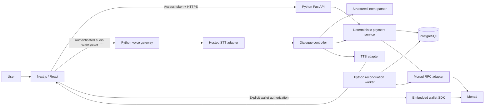

# Voice Payments on Monad — Product Requirements Document

**Working name:** Sendly (placeholder; availability not checked)  
**Owner:** Keyur Pawaskar  
**Version:** 1.5 — October 7, 2026 (see Section 28)  
**Status:** Product and engineering specification; no implementation or deployment implied  
**Frontend:** Next.js, React, TypeScript  
**Backend:** Python, FastAPI, PostgreSQL  
**Intended entry:** Monad Metropolis, Consumer Products & Payments  
**Scope of this document:** Full product vision, with a clearly bounded first release and independently scoped extensions. No delivery schedule.

## 1. Product decision

Build a conversational payments assistant that helps an authenticated user send a supported token to a trusted contact on Monad. The user speaks naturally, the assistant resolves the intended payment, asks about ambiguity, reads back the precise details, accepts a correction or explicit approval, and guides the wallet through execution. A receipt shows the actual transaction outcome.

**Product promise:** “Tell us who and how much. Review it, correct it, and send.”

**Demonstration promise:** A voice conversation can produce a real, inspectable test-network token transfer. Every demo screen must distinguish test funds from real funds.

**Long-term vision:** An accessible conversational interface for moving supported digital money between people, with clear recipient identity, understandable fees, strong confirmation, and dependable recovery from uncertainty.

This is a voice product with payment execution. The differentiator is how well it handles conversation and payment uncertainty together: “fifteen, not fifty,” two contacts called Mom, an interrupted read-back, a repeated confirmation, and a transaction whose outcome is not immediately known.

### 1.1 What is established and what is proposed

- Established from the owner's plan: solo builder; production browser-audio experience; Python and React/TypeScript strengths; interest in voice-agent roles; US-to-family-in-India motivation.
- Product hypothesis: conversation can make selected repeat payments easier for some users. This needs observation with users; it is not established market research.
- Architecture decisions below are recommendations, not existing capabilities.
- Provider support, contract addresses, bounty eligibility, network requirements, prices, and precise SDK versions must be validated when implementing.
- No claim of bank payout, INR delivery, currency conversion, compliance certification, audited custody, or universal recipient coverage is implied.

## 2. Problem and target users

### 2.1 Problem

Sending a digital-token payment typically requires navigating wallet terminology, selecting a network and asset, identifying an address, entering an amount, and interpreting transaction status. Voice may reduce input friction, but introduces ambiguity that is unacceptable to silently resolve when money moves.

The product must reduce effort without hiding the recipient, unit, fees, or irreversible nature of a submitted transfer.

### 2.2 Primary persona

An adult who already has supported tokens and periodically sends them to a small set of known recipients. They use a mobile browser, prefer familiar contact names, and want quick correction and a clear receipt. They are authenticated before initiating payment.

### 2.3 Secondary personas

| Persona | Job to be done | Product implication |
|---|---|---|
| Recipient | Receive and identify a payment without navigating technical setup alone | Email onboarding, a wallet bound to their account, a link code for senders, readable receipt |
| User who benefits from speech input | Complete a payment with less manual entry | Keyboard-equivalent actions, accessible transcripts, large controls |
| Hackathon judge | Understand and verify the product quickly | Guided test flow, funded demo setup, inspectable transaction |
| Technical interviewer | Assess engineering judgment and contribution | Architecture, evaluation artifacts, explicit limitations and reproducible tests |

### 2.4 Initial user story

“When I need to send tokens to someone I already know, I want to say the recipient and amount, correct anything the assistant misunderstood, and approve a precise payment so that I can finish confidently.”

The first release does not assume that a first-time recipient can receive money before onboarding. A payment can be drafted for that person, but sending waits for a confirmed contact destination (Section 5.7).

## 3. Outcomes and boundaries

### 3.1 Desired outcomes

1. Users complete an authorized transfer through a short conversation.
2. Users can recognize and correct errors before execution.
3. Users always know whether money has not been sent, is being submitted, has been submitted or included, has been sent (finalized), or has an unknown outcome.
4. The system prevents stale approvals and duplicate execution within its supported application flow.
5. A reviewer can inspect the transfer independently and reproduce the evaluations.

### 3.2 First-release scope

- Responsive English-language web application.
- Email-based authentication and one embedded-wallet provider.
- One configured Monad network per environment.
- One explicitly configured token per environment.
- Saved contacts with a stated assurance level: user-confirmed address or ownership-proven wallet (Section 5.7).
- Push-to-talk capture and streaming speech transcription.
- Text fallback using the same conversation and payment logic.
- Intent extraction, clarification, correction, read-back, explicit approval, and cancellation.
- Client wallet signing; Python owns application validation and payment state.
- Pending-state monitoring, receipt, activity history, and refresh recovery.
- Documented voice and payment evaluation suite.

### 3.3 Outside the first release

Bank-account delivery, INR payout, exchange-rate promises, arbitrary token discovery, cross-chain bridging, swaps, card funding, escrow, unclaimed-payment contracts, autonomous recurring payments, arbitrary third-party tool access, and custom custody infrastructure.

These are separate products or substantial integrations. Section 22 describes extensions without making them launch dependencies.

### 3.4 Explicit claims policy

- “Sent” requires a verified successful receipt matching the expected transfer, in a block the network reports as finalized.
- “Submitted” means broadcast evidence exists, not inclusion or settlement.
- “Included” means a receipt exists in a block that is not yet finalized. A receipt alone is not finality.
- Payment execution is enabled only with a signer that has passed the signer gate (Section 10.4); the “Fee up to” figure is shown only for payments that can execute under that gate.
- A payment that succeeded is never described as not sent, even if the wallet used different fee settings than approved.
- Do not describe a contact's assurance level as proof of a person's real-world identity.
- “Available to spend” is distinct from a displayed historical balance.
- Say “15 AUSD” only if the configured asset is verified AUSD. A mock token must use an unmistakably different demo name.
- Do not silently equate a token unit with a guaranteed dollar redemption value.
- Do not say “received in your bank” for a wallet transfer.
- Performance statements must identify what was measured and under which conditions.

## 4. Product principles

1. **The model proposes; deterministic code validates.** The LLM cannot sign, broadcast, mint approval, or change configured asset/network policy.
2. **Every approval has a precise object.** Recipient, amount, token, network, fee allowance, expiry, and version are bound together.
3. **Corrections are first-class interactions.** Editing never inherits approval from an older draft.
4. **Uncertainty is visible.** Do not convert a timeout into “failed” or a broadcast response into “paid.”
5. **Speech is an input method.** A voice recording is not a biometric identity check.
6. **Payment details remain visible.** Voice complements an accessible confirmation card.
7. **Familiar words, honest units.** Minimize jargon while preserving material information.
8. **Measure failures as carefully as success.** A good-looking happy path is insufficient evidence.

## 5. Canonical experience

### 5.1 Successful conversation with a correction

1. User signs in and sees a wallet balance, a clear network/demo indicator, and saved contacts.
2. User activates the microphone: “Send Mom fifty demo tokens.”
3. Partial transcript appears, visibly provisional.
4. Final transcript produces a proposed recipient and amount. Python resolves Mom against the user's contacts and validates the amount.
5. The confirmation card and synthesized read-back say: “Send 50 DemoUSD to the address you saved for Mom, ending 4821, on Monad testnet? Fee up to [amount] MON. Say “confirm payment” or press Confirm.” The microphone is unavailable while the read-back plays.
6. The read-back finishes and the confirmation challenge is armed. The user presses the microphone and says: “Actually, fifteen.”
7. The utterance does not match the confirmation grammar, so it is interpreted as a correction. The old challenge becomes invalid, the draft's amount changes to 15, a new review creates a new revision with fresh fees, and a new read-back plays.
8. After the new read-back finishes, the user presses the microphone and says “Confirm payment,” or presses the equivalent confirmation button.
9. The app records approval, revalidates the transfer, reserves a nonce, creates a payment attempt with the revision's pinned fee fields, and invokes the wallet's signing flow. Any provider-required authorization stays visible.
10. The app displays submitting, then “submitted” after receiving transaction evidence, then “included” when a receipt is found.
11. Python independently verifies the transaction. Once its block is finalized, the UI displays a receipt and says “15 DemoUSD sent to Mom.”

Interrupting the read-back by speaking (barge-in, VOICE-04) is a P1 extension. The first release demonstrates correction after the read-back finishes.

### 5.2 Ambiguous recipient

“Send Alex ten.” → “Alex Chen or Alex Patel?”

Display both saved contacts. Require a selection; never choose the most recent contact without showing and confirming it. The user's answer resolves only the recipient slot and does not authorize payment.

### 5.3 Unknown recipient

“Send Priya twenty.” → “Priya isn't in your contacts. Add Priya's address first.” Assistant copy refers to contacts by name, never by an inferred pronoun.

Fuzzy or phonetic contact matches (“Pria” for “Priya”) are treated as ambiguous: the assistant names the matched contact and the user must select it; a fuzzy match never fills the recipient slot silently.

The app may preserve a non-executable draft. The add-contact flow is separate. A model-generated address or an email string cannot become a payment destination.

### 5.4 Missing currency or ambiguous amount

“Send Mom fifty dollars.” → “Do you mean 50 DemoUSD on the test network?” in a demo environment.

“Send Mom one fifty” → ask whether the user means 1.50 or 150. Do not use model confidence alone to decide. “Send all of it” is unsupported initially and must ask for an explicit amount.

### 5.5 Cancellation and wallet rejection

Before signing begins, “Cancel” invalidates the draft approval and ends the flow. During a wallet prompt, attempt to dismiss/reject where supported, but do not claim cancellation until the result is known. After broadcast, explain that the app cannot undo the transfer and continue monitoring it.

If the wallet SDK reports an explicit user rejection, the attempt is marked rejected. The user may retry the same payment only while the approval is still valid and the payment details, nonce, and fee bounds are unchanged; otherwise a new review and approval is required. Any other wallet error, timeout, or lost result is an unknown outcome and blocks retry (Section 10.5). If the nonce is later used by a different transaction, the app reports that the payment was not made as approved; if the payment itself went through, it is shown as sent regardless of fee-field differences.

### 5.6 Recipient onboarding

A recipient opens the app, authenticates by email, creates or connects a supported wallet, and receives an app-generated receive page/QR with the network and address bound to their account. The receive page can also produce a short-lived link code. The sender explicitly adds that destination as a contact, either by entering the code or by entering and confirming the address.

Email is an onboarding identifier, not an onchain destination. Version one does not send to an unregistered email address or create an automatic claim-link escrow. Recipient invitations, if later implemented, require deliberate sender action and cannot imply funds have already arrived.

### 5.7 Contact assurance levels

A contact records what has been established about its destination. Address validity, wallet ownership, and a person's real-world identity are different guarantees.

| Level | How it is created | What it establishes | What it does not establish |
|---|---|---|---|
| `user_confirmed` | Sender enters or pastes an address; the app validates format and EIP-55 checksum (when mixed-case) and shows the full address for the sender to confirm | The sender reviewed and chose this exact address | That the intended person controls it |
| `ownership_proven` | Sender enters a recipient's link code; the address is a wallet bound to that recipient's authenticated Sendly account through provider-verified data or a signed ownership challenge | The address is controlled by the Sendly account that issued the code | That the account belongs to the person the sender calls “Mom” |

Both levels are executable. `user_confirmed` is required in the first release; `ownership_proven` depends on the receive page and link code (UX-03, P1). The payment card shows the level, and the read-back states it in plain language: “Mom's Sendly wallet ending 4821” versus “the address you saved for Mom, ending 4821.” The card shows at least the first 6 and last 4 address characters, with the full address expandable; a matching suffix is never treated as confirmation. Contacts are never created automatically from incoming transfers or activity history, because lookalike addresses are a known attack. A contact still awaiting the sender's confirmation is `pending_confirmation` and is not executable.

## 6. Functional requirements and acceptance criteria

Priority labels describe release boundaries, not a schedule. **P0** is necessary for a credible working product; **P1** improves the experience; **P2** expands the product.

| ID | Priority | Requirement | Acceptance criterion |
|---|---|---|---|
| AUTH-01 | P0 | Authenticate before wallet/account access | Unauthenticated HTTP and WebSocket requests cannot access private state |
| AUTH-02 | P0 | Bind wallet to authenticated user | Browser-supplied address alone never establishes ownership |
| CONTACT-01 | P0 | Manage saved contacts | User can add, rename, inspect, and remove their contacts; other users cannot access them |
| CONTACT-02 | P0 | Confirm destination changes | Address/network changes increment contact version and invalidate pending drafts and unspent approvals referencing the old binding |
| CONTACT-03 | P0 | State contact assurance | Every contact has `pending_confirmation`, `user_confirmed`, or `ownership_proven` status; only the latter two are executable; card and read-back state the level; no UI or copy calls either level identity verification |
| CONTACT-04 | P0 | Prevent lookalike destinations | Contact creation shows the full address; contacts are never auto-created from incoming transfers; suffix matches never count as confirmation |
| VOICE-01 | P0 | Explicit microphone lifecycle | Recording starts only after user action, with a visible indicator and Stop control; the microphone is unavailable while read-back plays |
| VOICE-02 | P0 | Stream provisional and final text | Partial transcripts cannot trigger payment approval or execution |
| VOICE-03 | P0 | Text parity | Typed requests use the same interpretation, validation, and review rules; typed approval is the keyboard-operable Confirm button (CONFIRM-04) |
| CONVO-01 | P0 | One active conversation per account | Creating a conversation while one is active returns the active one; a second device can inspect but not replace an active draft |
| DIALOG-01 | P0 | Extract constrained intent | Model output passes a strict schema before affecting a draft |
| DIALOG-02 | P0 | Ask about ambiguity | Ambiguous contacts (including fuzzy name matches), amounts, and units remain non-executable |
| DIALOG-03 | P0 | Support corrections | Every material correction edits the draft and requires a new review revision and approval challenge |
| DIALOG-04 | P0 | Recover from validation failure | A failed review creates no revision; the draft returns to `editing` with structured reasons and a spoken/visible explanation |
| CONFIRM-01 | P0 | Visible and spoken read-back | Recipient, assurance level, amount, asset, network, and maximum network fee derive from one canonical revision |
| CONFIRM-02 | P0 | Bind explicit approval | Using a challenge creates exactly one approval for the current revision; stale, reused, or expired challenges are rejected |
| CONFIRM-03 | P0 | Expire approval | Challenges and approvals expire independently; expired or revised drafts require a new read-back and approval |
| CONFIRM-04 | P0 | Deterministic confirmation rules | Spoken approval requires an armed challenge, a newly opened capture turn, no question marker, and a full-utterance match against the versioned narrow allowlist; typed text never approves; the LLM is never consulted for approval |
| PAY-01 | P0 | Validate balances, network, and wallet type | Insufficient token balance, insufficient native gas for the fee bound, a predicted or unevaluable reserve-balance risk, a delegated (unsupported) wallet, or wrong network prevents review and preparation |
| PAY-02 | P0 | Validate transfer payload | Only the configured token transfer to the approved address and amount can be prepared |
| PAY-03 | P0 | Serialize execution | A revision has at most one unresolved payment attempt; a wallet has at most one open nonce reservation; a retry reuses the reservation's nonce and is allowed only after an explicit rejection, with a valid approval and unchanged digest and fee bounds |
| PAY-04 | P0 | Recover uncertain submission | No new payment may use a wallet with an open reservation; within it, retry only after definitive rejection (invariant 8) and replacements only under Section 10.6; the reservation is released only under Section 9.3; an unchanged nonce never releases it or records non-submission |
| PAY-05 | P0 | Verify payment independently | Client-reported hash cannot alone mark payment successful; “Sent” requires a finalized transaction matching the approved payload (matching rule, Section 9.4) |
| PAY-06 | P0 | Report field compliance separately | Each attempt records whether the broadcast nonce, gas limit, and fee fields matched; a mismatch alerts and suspends the signer qualification but never changes the payment outcome or shows a succeeded payment as not sent |
| PAY-07 | P0 | Replacement attempts | A user can review and sign a zero-value self-transfer at an open reservation's nonce; the approval references an immutable replacement review (payload, fee fields, digest, expiry) and preparation uses only those fields; attempts have idempotency, states, and a cap; the payment becomes `NONCE_CONSUMED_OTHER` only when a non-matching transaction at that nonce is finalized |
| PAY-08 | P0 | Application limits | Per-payment and rolling 24-hour outgoing limits are configured per environment and enforced at review and prepare with `LIMIT_EXCEEDED` |
| PAY-09 | P0 | Signer gate | `prepare` is disabled (`SIGNER_NOT_QUALIFIED`) unless an active signer qualification with a recorded passing gate exists; no reduced-capability execution mode |
| UX-01 | P0 | Persistent activity and receipt | Refreshing restores payment outcome, field compliance, and reservation status from the backend |
| UX-02 | P0 | Accessible controls | Core flow works using keyboard and text without hearing audio |
| DEMO-01 | P0 | Documented test funding | Demo setup documents manual prefunding of each tester's own wallet with test MON and the demo token; no shared signing key |
| EVAL-01 | P0 | Reproducible behavior tests | Versioned fixtures and evaluation output document both successes and failures |
| VOICE-04 | P1 | Barge-in during read-back | User interruption halts playback, invalidates the challenge, and returns to interpretation |
| UX-03 | P1 | Recipient receive page | Authenticated recipient can display/copy their bound address and network and generate a link code |
| UX-04 | P1 | Repeat a payment | Previous receipt creates a new unapproved draft; it never resends directly |
| UX-05 | P1 | Incoming activity | Recipient sees finalized incoming transfers of the configured token; unknown senders show as addresses, never as contacts |
| DEMO-02 | P2 | Automated test funding | Optional; uses a separate funding wallet with per-user, per-day, and total limits; never a user's signing key |
| VOICE-05 | P2 | Multilingual conversations | Supported languages have independent test sets and explicit locale selection |

## 7. Frontend specification

### 7.1 Framework choice

Use **Next.js with React and TypeScript** for routing, a public project page, and the authenticated app shell. All payment business logic and provider secrets live in Python. Next.js is not a second business backend.

Browser-only components own microphone access, audio playback, and embedded-wallet interaction. Keep wallet/audio SDK imports out of server rendering. A plain React/Vite application remains a viable substitute if SSR is unnecessary; the API boundary stays the same.

Suggested UI stack: accessible primitives, Tailwind CSS, TanStack Query for server state, and a small typed reducer for conversation interaction. Generate shared API types from FastAPI's OpenAPI schema. Avoid duplicating authoritative payment state in a general-purpose client store.

### 7.2 Routes

| Route | Purpose |
|---|---|
| `/` | Product explanation, guided-demo entry, limitations and network disclosure |
| `/app` | Main voice payment workspace |
| `/app/contacts` | Saved recipients and address verification |
| `/app/activity` | Outgoing payment history, searchable by contact/status; incoming transfers when UX-05 ships |
| `/app/payments/[id]` | Private receipt, pending-payment details, and recovery actions for unresolved attempts |
| `/app/receive` | Own wallet address, network, QR, link code, and receive instructions |
| `/app/settings` | Voice preferences, data settings, wallet/account details |
| `/demo` | Clearly labeled guided test scenario; no shared signing credentials |

### 7.3 Main workspace layout

**Layout ownership.** The Sendly design guide (`SENDLY_DESIGN_GUIDE.md`, version 1.1 or later) owns visual layout, presentation, and copy style, including the speaking payment card. This PRD owns behavior, state, and authorization. The sketch below shows the information that must be present, not the layout; where the two documents differ on layout, follow the design guide.

Desktop: compact navigation; main conversation area; adjacent payment card; expandable activity details. Mobile: balance/header, payment card, conversation, fixed microphone/text controls. The critical payment details should not scroll out of view while asking for approval.

```text
┌────────────────────────────────────────────────────────────┐
│ Sendly                    TEST FUNDS • Monad testnet  User │
│ Available: 100 DemoUSD          Network fee balance: ...   │
├───────────────────────────────────┬────────────────────────┤
│ Conversation                      │ Review payment         │
│ You: Send Mom fifty               │ Mom                    │
│ Assistant: Send 50 DemoUSD ...?   │ 0x1a2b3c…4821          │
│ You: Actually, fifteen            │ Saved address          │
│ Assistant: Updated to 15 ...      │ 15 DemoUSD             │
│                                   │ Monad testnet          │
│                                   │ Fee up to: ... MON     │
│                                   │ [Edit] [Cancel]        │
│ [Tap to speak] [Type]             │ [Confirm 15 DemoUSD]   │
├───────────────────────────────────┴────────────────────────┤
│ Status: Ready for confirmation                             │
└────────────────────────────────────────────────────────────┘
```

### 7.4 Core components

- `AuthBoundary`: loads identity, wallet readiness, and account errors.
- `NetworkBanner`: persistent environment/token disclosure; expanded exact chain details.
- `BalanceSummary`: token balance, gas balance, freshness timestamp, pending reservations.
- `VoiceControl`: idle/listening/processing/speaking/disconnected indicators and stop control.
- `TranscriptFeed`: differentiates interim text, final user turns, assistant messages, and corrections.
- `RecipientPicker`: accessible choices with distinguishing names, assurance level, and masked addresses (first 6 + last 4 characters).
- `PaymentReviewCard`: renders the backend canonical revision, assurance level, maximum fee, and expiry.
- `ConfirmationControls`: voice listening state, explicit button alternative, Stop read-back, Replay, cancel/edit actions.
- `WalletActionPanel`: provider authorization, submitting, rejected-with-retry, and unknown states.
- `RecoveryPanel`: explains an open nonce reservation, shows evidence checked, and offers a replacement attempt (PAY-07) with its own review; never offers a plain resend.
- `PaymentTimeline`: user-facing milestones (submitted, included, sent); technical details collapsed.
- `ReceiptCard`: amount/unit, contact snapshot and assurance level, address, network, time, hash, finalized status.
- `ConnectionStatus`: distinguishes audio transport failure from payment status.

### 7.5 Copy and interaction rules

- Use “Checking your payment” while validating; never “Sending” while only parsing speech.
- Confirmation button includes the amount where space permits: “Confirm 15 DemoUSD.”
- Before wallet signing: “Approve this payment in your wallet if prompted.”
- Submitted: “Payment submitted. Waiting for confirmation.”
- Included: “Payment included in a block. Waiting for it to be finalized.”
- Sent (finalized): “15 DemoUSD sent to Mom.”
- Unknown: “We couldn't confirm whether this was submitted. Don't resend yet; we're checking.”
- Rejected (retry allowed): “You declined in your wallet. Nothing was sent. You can try again until [time].”
- Not made as approved (`NONCE_CONSUMED_OTHER`): “This payment wasn't made as approved. A different transaction from your wallet used its place. Check it before sending again.” Link the other transaction.
- Sent with fee-field mismatch: “15 DemoUSD sent to Mom. Your wallet used different network-fee settings than approved; fee charged: [amount]. We've flagged this for review.” Never suggest sending again.
- Reverted: “The transfer failed. A network fee may still have been charged.”
- Fee: show `gasLimit × maxFeePerGas` as “Fee up to.” Monad charges for the full gas limit, so the figure should not assume unused gas is refunded. After a payment, show the fee actually charged from the receipt.
- Browser audio denial: offer text input immediately; do not repeatedly prompt for microphone permission.
- Do not use confetti or a success sound before verified success.
- Address and technical details are expandable, never inaccessible.

### 7.6 Accessibility and mobile behavior

Target WCAG 2.2 AA in implementation review. Use visible focus, semantic controls, descriptive labels, sufficient contrast, reduced-motion support, and status announcements that do not read every interim transcript token. Provide captions for all assistant speech. Color alone must not communicate transaction status.

Handle mobile browser microphone restrictions and audio-playback activation explicitly. Backgrounding a tab stops recording. On return, reload authoritative payment state. Do not automatically restore confirmation listening or trigger wallet actions.

## 8. Voice and conversation design

### 8.1 Supported intents

`create_payment`, `correct_amount`, `correct_recipient`, `select_recipient`, `cancel_payment`, `check_balance`, `check_payment_status`, `help`, and `unsupported`.

Confirmation is deliberately not an LLM intent. It is decided by the deterministic grammar in Section 8.3 before any model call; an utterance that fails the grammar goes to the intent parser as an ordinary turn.

Restrict one active payment conversation per account initially (CONVO-01). Concurrent sessions can inspect activity but cannot silently replace the active draft. Starting another payment explicitly abandons the unsubmitted draft, or waits if execution is unresolved.

### 8.2 Audio pipeline

Browser microphone → AudioWorklet capture → audio format normalization → authenticated WebSocket to FastAPI → streaming STT provider → final transcript → intent parser → deterministic dialogue controller → response text/TTS → browser playback.

Record the actual input sample rate. Either send a provider-supported native format or explicitly resample to the configured rate; never label 48 kHz samples as 16 kHz. Include stream format, sample rate, channels, session ID, and sequence metadata. Bound frame sizes and queue depth; discard/stop cleanly on excessive backlog instead of letting old speech become a delayed approval.

Use a hosted STT adapter initially. Deepgram is a candidate, not a locked contractual choice. Endpointing and final-transcript handling must be tested separately from payment logic. A final STT segment is not always a completed human turn; accumulate provider segments until the configured turn boundary. [S3]

### 8.3 Confirmation listening

Start in push-to-talk mode. The microphone is unavailable while read-back plays; a visible Stop read-back control halts playback. A voice confirmation challenge is armed only after the current read-back plays to completion. Stopped playback does not arm voice confirmation; the user can replay the read-back, edit, cancel, or approve with the Confirm button, which is itself an explicit visible review action. Ignore captured assistant playback as an approval source. Do not buffer an early “yes” and apply it after a later read-back.

**Spoken confirmation grammar.** Approval is decided by deterministic code, never by the LLM:

1. The challenge is armed, unexpired, and bound to the current review revision.
2. The utterance comes from a capture turn opened after `confirmation_armed` was sent for that challenge. Only the first final turn of that capture is evaluated.
3. **Question check, before normalization.** If the raw transcript contains a question mark, or the STT provider marks the segment as a question, the utterance is rejected as a confirmation.
4. **Normalization.** Lowercase, remove remaining punctuation, and strip a small fixed set of leading fillers (“um,” “uh,” “okay”).
5. **Full match against a narrow allowlist.** The default allowlist is “confirm payment” and “yes confirm payment.” Partial or prefix matches do not count, and any extra token rejects the match: numbers, contact names, negations, conditionals, hedges, and question words never confirm. “Yes, but fifteen,” “don't send,” “did you say yes?”, “send it?”, and “yes yesterday” must not trigger signing. The read-back ends with “Say ‘confirm payment’ or press Confirm.”
6. A non-matching utterance is routed to the intent parser as an ordinary turn (often a correction) and the challenge is invalidated if the turn changes the draft. It never becomes approval through a second path.

The allowlist, normalization rules, and their test cases are versioned together and recorded in evaluation runs.

**Known limitation.** Transcription often omits punctuation, and a phrase list cannot detect questioning intonation. The question check catches only what the transcript marks. The narrow two-word phrase reduces the chance that a casual or questioning remark matches, and the wallet authorization prompt remains the final safeguard. Broader phrases such as “yes” or “send it” are deliberately excluded.

**Typed confirmation.** Typed text never approves a payment. The typed path approves only through the keyboard-operable Confirm button bound to the current challenge. A typed “yes” receives a reply that moves focus to the Confirm button.

This is not guaranteed protection against another person speaking near the device, synthetic speech, or a compromised browser. Real-value use retains wallet authorization and any required stronger authentication. Do not advertise voice biometrics.

### 8.4 Read-back generation

Use deterministic templates populated by the review revision rather than free-form LLM prose for material details. Format decimal amounts consistently and speak the token unit. If contacts share names, include the differentiator. Produce the on-screen and spoken versions from the same canonical data.

If TTS fails, show the full payment card and use explicit on-screen review/confirmation. This is a visible degraded mode, not an invisible omission of confirmation.

### 8.5 Corrections and interruption

Any correction cancels outstanding TTS and invalidates the current challenge. Use a new turn ID; the correction edits the draft (new `draft_version`) and a new review creates a new revision. Preserve unaffected slots only if the correction is unambiguous. “No, Dad” changes the recipient, not the amount; “No, cancel” cancels. If the user changes their mind while signing is already in progress, do not mutate the transaction under the signer; resolve/cancel that execution first.

### 8.6 LLM boundary

The LLM receives only the current task context and minimum necessary contact candidate labels. It returns structured proposals with raw spans and ambiguity markers. Never expose private keys, wallet authorization secrets, arbitrary RPC credentials, or unneeded account history.

Contact names, payment notes, and transcript content are untrusted data. A contact named “ignore previous instructions” remains a contact label. The model cannot choose a token contract, chain ID, arbitrary destination address, or a signing tool.

Do not use model self-reported confidence as the only authorization condition. Validate extracted values and require human review even when the model appears certain.

## 9. State machines and invariants

Five records have their own lifecycles: the conversation (what the assistant is doing), the editable draft (what the user is asking for), the review revision (the immutable payment the user approves), the nonce reservation (one wallet nonce and everything that competes for it), and attempts (each request to the wallet to sign). Persisted states use the exact names below; API responses and tests use the same names in lowercase.

Two results are always reported separately for a payment attempt: its **payment outcome** (did the approved transfer happen) and its **field compliance** (did the broadcast transaction use the approved nonce and fee fields). A compliance problem never changes the payment outcome.

### 9.1 Conversation state

```text
IDLE → LISTENING                     (user starts capture)
IDLE → INTERPRETING                  (typed turn)
LISTENING → INTERPRETING             (turn complete)
LISTENING → IDLE                     (capture stopped with no speech, or audio failure)
INTERPRETING → CLARIFYING            (ambiguity, unknown contact, or validation failure with reasons)
INTERPRETING → REVIEWING             (review revision issued; card shown, read-back starts)
INTERPRETING → IDLE                  (non-payment intent answered: balance, status, help, unsupported)
CLARIFYING → LISTENING / INTERPRETING  (user answers by voice / text)
REVIEWING → AWAITING_CONFIRMATION    (read-back played to completion; voice challenge armed)
REVIEWING → REVIEW_PAUSED            (user stopped playback or TTS failed; card visible, voice not armed)
REVIEW_PAUSED → REVIEWING            (replay)
REVIEWING / REVIEW_PAUSED / AWAITING_CONFIRMATION → INTERPRETING   (typed correction or Edit)
REVIEWING → INTERPRETING             (barge-in; P1, VOICE-04)
AWAITING_CONFIRMATION → CONFIRMATION_LISTENING  (user opens a capture turn)
CONFIRMATION_LISTENING → APPROVED    (first final turn passes the confirmation grammar)
CONFIRMATION_LISTENING → INTERPRETING  (any other utterance)
AWAITING_CONFIRMATION / REVIEW_PAUSED → APPROVED   (Confirm button with current challenge)
APPROVED → EXECUTING                 (payment attempt created)
EXECUTING → APPROVED                 (attempt explicitly rejected and approval still valid; retry offered)
EXECUTING → COMPLETED                (payment outcome final, or unresolved and acknowledged by the user)
COMPLETED → IDLE                     (user starts a new request or dismisses the result)
Any state before EXECUTING → CANCELLED → IDLE
Any state before EXECUTING → EXPIRED → IDLE   (challenge/approval expiry or session expiry)
```

Disconnecting ends audio capture but does not reset an already-submitted payment. A reconnect reads the canonical server state and starts a fresh voice turn; it never restores `AWAITING_CONFIRMATION` or `CONFIRMATION_LISTENING` without a new read-back or an explicit visible review action. An open nonce reservation remains visible from `COMPLETED` and blocks new payments from the same wallet (PAY-04) even though the conversation can return to `IDLE`.

### 9.2 Draft and review revision

The **draft** is editable: it holds the requested contact and amount and changes with every correction under an optimistic `draft_version`. A **review revision** is created only by a successful review: validation, fee estimation, and reserve evaluation run first, and the revision is then written once with every field in Section 10.1. It is never updated. Any later change (a correction, a contact change, a challenge expiring, or a fee estimate that no longer fits the approved bounds) is handled by a new review, which creates a new revision.

Draft status:

```text
EDITING → VALIDATING                (review requested)
VALIDATING → EDITING                (validation failed; structured reasons stored on the draft; no revision created)
VALIDATING → IN_REVIEW              (revision created; challenge issued)
IN_REVIEW → EDITING                 (correction or Edit; current revision superseded)
IN_REVIEW → EXECUTING               (payment attempt created)
EXECUTING → IN_REVIEW               (attempt REJECTED; retry permitted under invariant 8)
EXECUTING → EDITING                 (attempt REJECTED; retry not permitted; user may review again)
EXECUTING → CLOSED                  (payment outcome final)
EDITING / IN_REVIEW → CANCELLED
```

Review revision status:

```text
(created) → AWAITING_APPROVAL
AWAITING_APPROVAL → APPROVED                 (challenge used; approval created)
AWAITING_APPROVAL / APPROVED → SUPERSEDED_BY_REVISION   (draft edited, contact changed, or re-estimate exceeds bounds)
AWAITING_APPROVAL → EXPIRED                  (challenge expired before use)
APPROVED → EXPIRED                           (approval expired before an attempt was created)
APPROVED → EXECUTING                         (payment attempt created)
EXECUTING → APPROVED                         (attempt REJECTED; approval still valid)
EXECUTING → EXPIRED                          (attempt REJECTED; approval no longer valid)
EXECUTING → CLOSED                           (payment outcome final)
AWAITING_APPROVAL / APPROVED → CANCELLED
```

Expired, cancelled, and superseded revisions are never executed. Starting again means a new review of the draft, never an automatic resend. A draft in `EXECUTING` cannot be cancelled by the app; the user is told what is still being determined.

### 9.3 Nonce reservation group

A nonce reservation is created by the first payment attempt for an approved revision. It holds one sender wallet's nonce N. Every attempt that may use N belongs to its group: the payment attempt, any retry after an explicit rejection (which reuses N because nothing was signed), and any replacement attempts (Section 10.6).

```text
OPEN → RELEASED
```

A group is released, recording one chain outcome, only when one of these holds:

| Chain outcome | Release condition |
|---|---|
| `PAYMENT_INCLUDED` | A finalized transaction from the sender at N carries the approved payment payload |
| `OTHER_TRANSACTION` | A finalized transaction from the sender at N does not carry the approved payment payload (a replacement or external activity) |
| `UNUSED` | Every member is `REJECTED` (nothing was ever signed), and no further retry is possible because the approval has expired or the draft was cancelled or re-edited |
| `OPERATOR_RESOLVED` | Only for a reservation with a `nonce_incident` (Section 9.4): an operator records the evidence and resolution |

A reservation with an open `nonce_incident` cannot be released by the automatic conditions above.

When a group is released on a finalized transaction, any member still in `SIGNING` can at most sign a transaction at a nonce that is already used, which cannot be included. Release is therefore safe even if a stale wallet prompt is still open: the frontend dismisses prompts for released groups, and late callbacks are handled under Section 10.6. A wallet has at most one `OPEN` group, which serializes nonce allocation and payments per wallet.

### 9.4 Payment attempt state (payment outcome)

```text
SIGNING → REJECTED                (wallet SDK returned a recognized explicit user-rejection result; nothing signed)
SIGNING → SUBMITTED               (transaction hash reported by the wallet or found during reconciliation)
SIGNING → SUBMISSION_UNKNOWN      (any other error, timeout, lost callback, or crash)
SUBMITTED → INCLUDED              (receipt found)
SUBMITTED → RECONCILING           (hash not found by deadline, or RPC sources disagree)
INCLUDED → SUCCEEDED              (block finalized; receipt success; approved payment payload and Transfer event verified)
INCLUDED → REVERTED               (block finalized; receipt status failed)
INCLUDED → PAYLOAD_MISMATCH       (block finalized; the wallet reported this hash but the payload is not the approved payment)
INCLUDED → RECONCILING            (receipt or block evidence missing or changed before finality)
SUBMISSION_UNKNOWN / RECONCILING → SUBMITTED / INCLUDED       (evidence for this attempt found)
SUBMISSION_UNKNOWN / RECONCILING → NONCE_CONSUMED_OTHER       (group released with OTHER_TRANSACTION)
```

Terminal: `REJECTED`, `SUCCEEDED`, `REVERTED`, `PAYLOAD_MISMATCH`, `NONCE_CONSUMED_OTHER`. Unresolved: `SIGNING`, `SUBMITTED`, `INCLUDED`, `SUBMISSION_UNKNOWN`, `RECONCILING`.

User-facing payment outcome maps from these states: succeeded (`SUCCEEDED`), reverted (`REVERTED`), unknown (any unresolved state), not made as approved (`NONCE_CONSUMED_OTHER`), and needs review (`PAYLOAD_MISMATCH`, which also alerts operations).

**Matching rule.** A transaction is this attempt's payment if it is from the sender at nonce N and its chain ID, `to`, `data`, and `value` equal the prepared payment payload. Hash, gas limit, and fee fields are **not** part of the match. A wallet that changes only fee fields has still made the payment.

**Unexpected-nonce incident.** If the wallet reports a hash whose transaction has nonce M ≠ N, the signer has broken the gate's first requirement. The backend:

1. records field compliance `MISMATCHED` (nonce), opens a `nonce_incident` on the reservation, raises an alert, and suspends the signer qualification, so no new payment can be prepared with it;
2. reconciles both the reported transaction at M and the reserved nonce N;
3. if the transaction at M is finalized and matches the approved payload (chain ID, `to`, `data`, `value`), shows that independently verified transfer accurately: the attempt becomes `SUCCEEDED` with the incident attached, and the UI shows it as sent. If it reverted or does not match, the attempt becomes `REVERTED` or `PAYLOAD_MISMATCH` accordingly;
4. keeps the reservation at N open, blocking the wallet, and never suggests a resend, until an operator records a resolution after establishing what happened at N (for example, a finalized transaction at N has been identified and attributed, or it has been confirmed that no transaction from this attempt can use N).

This path is expected to be rare because the signer gate requires nonce preservation, but it has its own failure-injection test.

There is deliberately no transition to a “not sent” state based on an unchanged sender nonce. An unchanged nonce is consistent with a transaction that is pending, queued, or not visible to the queried node. The only exits from `SUBMISSION_UNKNOWN` are evidence for this attempt or the group's release.

### 9.5 Field compliance

Recorded on each attempt that reaches the chain, independently of its payment outcome:

```text
NOT_CHECKED → MATCHED       (nonce, gas limit, maxFeePerGas, maxPriorityFeePerGas equal the pinned values)
NOT_CHECKED → MISMATCHED    (any of those differ; the differing fields are stored)
```

`MISMATCHED` records a `signer_field_mismatch` event, raises an alert, and disables new payment preparation for that signer qualification until reviewed (Section 10.4). It never changes the payment outcome. A `SUCCEEDED` attempt with `MISMATCHED` fields is shown as sent, with the actual fee charged and a note that the wallet used different fee settings, and the app never suggests sending again.

### 9.6 Mandatory invariants

1. Only the authenticated owner can inspect, approve, or execute their draft.
2. A challenge can be used at most once, and only for the review revision and digest it was issued for. An approval references exactly one challenge and one review revision.
3. Approval cannot be created from interim transcripts, assistant audio, an LLM output, typed text, or a stale turn.
4. Review revisions are immutable. Changing recipient, contact binding or assurance level, amount, token, chain, or fee bounds requires a new review revision; approvals for older revisions become unusable.
5. Amounts are positive decimal strings with no more fractional digits than the token supports, converted to integer base units without floating-point arithmetic.
6. The prepared transaction's chain, token contract, calldata recipient, amount, zero native value, nonce, gas limit, and fee fields match the approved revision and the attempt record.
7. A revision has at most one unresolved payment attempt. A wallet has at most one open nonce reservation.
8. A new payment attempt for a revision is allowed only when every previous attempt for it is `REJECTED`, the approval is unexpired and unspent, and the digest and fee bounds are unchanged. It reuses the group's nonce.
9. Repeated requests with the same idempotency key return the existing attempt or its uncertainty state; they do not initiate another signature.
10. “Sent” requires a finalized transaction that matches the approved payment payload and emits the expected Transfer event.
11. Payment outcome and field compliance are separate. A fee-field mismatch never produces a “not sent” outcome.
12. Unknown does not mean failed, and an unchanged nonce does not mean not sent. While any attempt is unresolved, do not release the nonce reservation or free reservations of funds. No new payment may use a wallet with an open reservation. Within that reservation, a payment retry is allowed only after definitive rejection under invariant 8; replacement attempts follow Section 10.6.
13. Application limits (PAY-08) are app-level checks, not wallet-wide onchain limits. External wallet activity can consume nonces and change balances and must be reconciled.

## 10. Payment approval and execution design

### 10.1 Draft and review revision contents

The **draft** stores `user_id`, `draft_id`, `draft_version`, conversation, requested contact, requested display amount, status, and structured validation reasons.

A **review revision** stores `draft_id`, revision number, `contact_id`, `contact_version`, contact assurance level, recipient label snapshot, resolved recipient address, sender wallet ID/address, chain ID, token contract, token decimals, display amount, integer base-unit amount, gas limit, `maxFeePerGas`, `maxPriorityFeePerGas`, maximum network fee (`gasLimit × maxFeePerGas`), the signer qualification in force, creation time, and a canonical digest. All of these are computed before the row is written.

Use a documented canonical serialization with fixed field names and integer amounts represented as strings. A digest supports consistency checks; it is not itself a wallet signature or proof of user consent. The nonce is not part of the revision; it belongs to the nonce reservation (Section 9.3).

### 10.2 Challenges, approvals, and consumption

| Event | When | Effect |
|---|---|---|
| **Challenge issued** | Successful review (`POST …/review`) | Random one-use ID bound to the authenticated session, review revision, digest, and expiry. Proposed default validity: 60 seconds, configurable and usability-tested. |
| **Approval recorded** | Spoken confirmation passing the grammar, or Confirm button | The challenge is marked used and exactly one approval is created in the same transaction. The approval records source (`voice` or `button`), challenge ID, revision digest, server timestamp, final confirmation-turn reference, and its own expiry (proposed default: 120 seconds, covering the wallet prompt). |
| **Approval spent** | A payment attempt leaves `SIGNING` for any state other than `REJECTED` | The approval can no longer create attempts. |

`POST …/prepare` re-checks balances, reserve rules, limits, contact version, and the fee estimate. If the current estimate fits within the revision's pinned gas limit and `maxFeePerGas`, it proceeds with the pinned values; if not, it returns `FEE_BOUND_EXCEEDED`, the revision becomes `SUPERSEDED_BY_REVISION`, and the user must review again. A transient check failure creates no attempt and leaves the approval unspent until expiry.

Approval expiry gates the creation of attempts only: it cannot stop a wallet prompt that is already open. Each attempt therefore has its own signing deadline; when it passes, the frontend dismisses the prompt where supported, and if no definitive result arrives the attempt becomes `SUBMISSION_UNKNOWN`.

Store the minimum transcript evidence needed under the user's data setting. Client-provided timestamps are diagnostic only.

### 10.3 Fees, balances, reserve rules, and limits

**Fees.** Monad charges the full gas limit set in a transaction, not the gas used. [S8] At review, estimate gas for the configured token transfer, add a modest margin chosen from measured tests, and pin that gas limit together with `maxFeePerGas` and `maxPriorityFeePerGas`. Excessive limits cost the user more. Show the native gas currency separately from the transferred token, and present `gasLimit × maxFeePerGas` as “Fee up to.” Never silently reduce the amount to fit a balance.

**Reserve balance.** Monad's asynchronous execution uses reserve-balance rules. [S9] As documented at the time of writing: each externally owned account has a default reserve (10 MON); at execution, a transaction cannot leave the account's balance below the reserve except through the sender's own gas spend; at consensus, the gas fees of the account's in-flight transactions must fit within a reserve budget; undelegated accounts sending their first transaction within a recent window of `k` blocks can spend below the reserve, while EIP-7702-delegated accounts cannot use that exception. A violation either excludes the transaction at consensus or reverts it at execution (with a fee charged).

First-release assumptions and adapter behavior:

- **Supported wallets:** undelegated EOAs only. The adapter reads the account code; if it contains an EIP-7702 delegation designator, preparation fails with `UNSUPPORTED_WALLET_TYPE`. The provider's default embedded-wallet type is confirmed in the signer gate.
- **Payload:** a token transfer with zero native value, so only gas spend draws on the native balance.
- **Gas coverage:** the native balance must be at least `gasLimit × maxFeePerGas`, or preparation fails with `INSUFFICIENT_GAS`.
- **In-flight transactions:** the app allows one open reservation per wallet. The adapter also compares the sender nonce at the latest block with the nonce `k` blocks earlier; a difference means other recent transactions, and preparation returns `RESERVE_BALANCE_RISK` with “Try again in a few seconds.”
- **Fail closed:** if any of these cannot be evaluated (for example, historical nonce queries are unavailable), return `RESERVE_BALANCE_RISK` rather than assuming an exemption.
- **Configuration:** the reserve amount and `k` are environment configuration checked against current documentation, not constants in code. The chain test suite covers wallets with native balances above and below the reserve.

**Application limits (PAY-08).** Each environment configures `max_payment_amount` and `daily_outgoing_amount` in token units, applied per user across all of the user's wallets. Review and prepare reject amounts over the per-payment limit with `LIMIT_EXCEEDED`.

The daily check counts each logical payment (one review revision that has a nonce reservation) at most once, at its approved amount:

```text
committed = Σ amount of logical payments whose reservation is open, regardless of age
          + Σ amount of logical payments, not already counted above, whose payment attempt
              finalized as SUCCEEDED or PAYLOAD_MISMATCH within the last 24 hours
proposed  = amount of the payment being checked, unless it already has an open reservation
            (a retry within that reservation is already counted in committed)
reject with LIMIT_EXCEEDED if committed + proposed > daily_outgoing_amount
```

`REVERTED`, `NONCE_CONSUMED_OTHER`, and `UNUSED` outcomes move no tokens and are not counted. `PAYLOAD_MISMATCH` is counted at the approved amount until an operator reviews it. The check runs at review (advisory, to give early feedback) and again at `prepare` inside the transaction that opens the reservation, holding a lock on the user's row, so two concurrent payments from different wallets or tabs cannot both pass. These limits are app-level checks and cannot constrain transactions made outside the app.

**Reservations of funds.** Reserve the pending token amount and fee bound in application accounting while a nonce reservation is open. Re-check fresh onchain balances close to signing.

### 10.4 Signing and the signer gate

**Execution path: sign-only plus backend broadcast.** The browser asks the authenticated user's embedded wallet to **sign** the prepared transaction without broadcasting it (Privy `useSignTransaction`). [S1] The backend then validates and broadcasts it. Python prepares and validates the unsigned payload and never holds the user's private key. The wallet's send-and-broadcast mode is not used on the product path: it returns no hash until the user dismisses the wallet's success screen, and its error screen offers a retry that can resend at a fresh nonce. Send mode remains only in the diagnostic signer harness.

The prepared payload is a type-2 (EIP-1559) transaction with explicit `chainId`, `to` (token contract), `data`, `value` = 0, `nonce`, `gas`, `maxFeePerGas`, and `maxPriorityFeePerGas`. The frontend checks that the selected wallet and chain match before invoking the SDK and passes every field through. **Quantities, including the nonce, are passed to the wallet as hex strings**: Privy 3.47.0 drops a numeric `0` nonce through a truthiness check and fills the account nonce instead. Every wallet call has a timeout; no result within it is an unknown outcome (Section 10.2), never a failure. Retain provider-required authorization prompts. Voice approval is app-level consent; it does not bypass wallet authentication or guarantee hands-free execution on every provider/device.

**Backend executor requirements (build stage B3).** Between signature and broadcast the backend is the validation boundary:

1. The per-wallet nonce reservation (Section 9.3) is opened and locked **before** the signature is requested.
2. The returned signed transaction is decoded and checked against the approved revision and the attempt: sender, chain ID, `to`, `data`, `value`, nonce, gas limit, and fee fields. A mismatched, stale (approval spent or expired), or conflicting submission is rejected and **not broadcast**.
3. The signed transaction bytes, hash, nonce, and a broadcast job are persisted **atomically, before anything is sent**. Storing only the hash is insufficient: after a crash the backend must be able to rebroadcast the identical bytes.
4. The backend broadcasts after validating the RPC's chain ID. After a timeout it reconciles the known hash and rebroadcasts the **same bytes**; it never requests a new signature at a new nonce for the same payment.
5. Sendly's review card is the substantive payment review surface. The wallet prompt may not show the transfer amount (Privy's shows the wallet balance) and is not described as an independent confirmation of recipient and amount.

The signer harness under `/gate` is a measurement tool, not this executor.

**Signer gate (release blocker).** Payment execution is enabled only for a **signer qualification**: a specific wallet provider, SDK version, and wallet type with a recorded passing gate result on the target network. The gate requires that the signer:

1. **signs exactly the requested transaction** in sign-only mode: the decoded signed transaction carries the supplied nonce (including nonce 0, when passed in the encoding the integration uses), gas limit, `maxFeePerGas`, `maxPriorityFeePerGas`, recipient, data, value, and chain ID, or the call errors instead of silently changing them;
2. returns a distinguishable result for explicit user refusal, different from a network or provider failure;
3. **signs a replacement as requested while another transaction at that nonce is outstanding**: a zero-value self-transfer at the specified nonce with the requested fee fields, decoded and verified. Whether the replacement is then *included* is a property of the network, recorded separately in the gate report and not a signer criterion; and
4. creates undelegated EOAs, or the product's reserve handling has been extended for the wallet type it creates.

Every criterion is judged on decoded signer output, not on whether a transaction later wins a race on-chain.

The result is recorded in `docs/signer-gate.md` and referenced by an environment setting. If no qualification is configured, `prepare` returns `SIGNER_NOT_QUALIFIED`. There is no reduced-capability execution mode in the first release: if the configured signer fails the gate, payment execution is not released, and the fix is a different signer or SDK version, not a different label. Upgrading the SDK requires running the gate again.

**Runtime check.** After a hash is reported or discovered, the backend fetches the transaction and records field compliance (Section 9.5). A `MISMATCHED` result suspends the qualification: new `prepare` calls return `SIGNER_NOT_QUALIFIED` until an operator reviews it. Payment outcome is still decided by the matching rule and chain evidence.

Do not introduce a Node business service solely for signing. Server-delegated signing is an optional later architecture requiring a separate permissions and revocation design (Section 22.1).

### 10.5 Nonces, duplicates, and reconciliation

**Nonce allocation.** The first `prepare` for an approved revision opens a nonce reservation inside a database transaction that locks the wallet binding row. N is the account's current nonce read from the configured RPC at that moment, never the previous app nonce + 1. Monad does not provide a global mempool view, so the app tracks the nonces it issues and reconciles them against receipts rather than relying on pending-transaction queries. [S10] Retries after explicit rejection reuse N within the same group.

**External wallet activity.** Transactions made from the same wallet outside Sendly can consume N. The group is then released as `OTHER_TRANSACTION` once that transaction is finalized, and the payment attempt becomes `NONCE_CONSUMED_OTHER`. The UI links the other transaction so the user can see what happened before deciding whether to start a new payment.

**Idempotency.** Backend idempotency keys are scoped to user and operation and store request fingerprints. Reusing a key with different input returns conflict. Section 12.1 lists the constraints and transactional rules that stop two clients creating distinct attempts for the same revision or opening two reservations for a wallet.

**Crash window.** The attempt is persisted in `SIGNING` before the wallet opens. If the browser closes after broadcast but before reporting the hash, the backend cannot assume nothing happened. When the signing deadline passes without a result, the attempt becomes `SUBMISSION_UNKNOWN` and the worker reconciles the group:

| Evidence at nonce N | Result |
|---|---|
| Provider action history or a reported hash identifies a transaction for this attempt | Attempt `SUBMITTED` / `INCLUDED`; continue verification |
| Sender's finalized nonce has not passed N and no transaction is found | Group stays `OPEN`; attempt stays `SUBMISSION_UNKNOWN`. The transaction may be pending, queued, or invisible to this node. |
| Finalized transaction at N matches the payment payload (matching rule, Section 9.4) | Group released `PAYMENT_INCLUDED`; attempt verified to `SUCCEEDED` or `REVERTED`; field compliance recorded separately |
| Finalized transaction at N does not match the payment payload | Group released `OTHER_TRANSACTION`; payment attempt `NONCE_CONSUMED_OTHER` |
| Sender's nonce has passed N but the transaction at N is not yet identified | Attempt `RECONCILING`; group stays `OPEN`; keep searching. Do not assume it was this payment, and do not assume it succeeded. |

Do not infer success merely from finding a historical transfer with the same amount and recipient. Correlate by sender, nonce, and payload, and inspect the actual transaction. An idempotency key in PostgreSQL alone cannot guarantee exactly-once broadcast through an external wallet; document this limitation and test the crash window explicitly.

### 10.6 Replacement attempts

> **Observed on Monad testnet (2026-10-07), single observation.** A transaction queued behind a nonce gap was "accepted" by the RPC but not visible; a higher-fee replacement at the same nonce was also "accepted"; when the gap was filled the **original** was included and the replacement never was. Transactions priced below the base fee are rejected at submission. Until Monad's replacement semantics are confirmed, treat replacement as best-effort: it cannot be the only recovery path, RPC acceptance is not evidence of inclusion, and the executor must never create nonce gaps (allocate from the chain's current nonce, one unresolved attempt per wallet). Reconciliation by sender + nonce + payload remains authoritative.

For a group that stays open past a configured period with its payment attempt unresolved, the user may choose to sign a **replacement**: a zero-value transfer to their own address at nonce N. It competes with the original payment and cannot undo it. If the payment is finalized first, the replacement cannot be included; if the replacement is finalized first, the payment cannot be included. Whether a higher fee makes the replacement more likely to win depends on the network and provider and is measured in the signer gate, not promised. Copy states plainly that this is an attempt to stop the payment, not a cancellation.

Replacement attempts have the same discipline as payment attempts:

- **Replacement review:** the backend first creates an immutable replacement review containing sender, chain ID, nonce N, destination (the sender's own address), zero value, empty data, gas limit, `maxFeePerGas`, `maxPriorityFeePerGas`, fee bound (`gasLimit × maxFeePerGas`), a canonical digest, and an expiry. The recovery panel renders exactly this object with an explanation. Different fee settings require a new replacement review.
- **Approval:** approved only with the Confirm button (no voice). The replacement approval references one replacement review and its digest, is single-use, and expires (proposed default: 120 seconds).
- **Preparation:** `prepare` builds the unsigned transaction only from the approved review's fields and verifies the digest; it cannot change fee settings. Field compliance is checked against the review.
- **Idempotency:** creating a review, approving it, and preparing an attempt each require an `Idempotency-Key`; a repeated key returns the existing object.
- **Concurrency:** a group has at most one replacement in `SIGNING`. Another replacement may be created after the previous one is `REJECTED`, or after its signing deadline passes. A configurable cap (default 3 per group) limits the number of replacement attempts. Fee exposure is bounded separately: a network fee is charged only for a transaction that is included, at most one transaction at N can be included, and each replacement's fee is bounded by its approved review.
- **States:**

```text
SIGNING → REJECTED / SUBMITTED / SUBMISSION_UNKNOWN
SUBMITTED → INCLUDED / RECONCILING
INCLUDED → WON                     (finalized; this replacement consumed N)
INCLUDED → RECONCILING             (evidence changed before finality)
SUBMISSION_UNKNOWN / RECONCILING → SUBMITTED / INCLUDED
Any unresolved state → LOST        (group released and this replacement did not consume N)
```

  `WON` releases the group as `OTHER_TRANSACTION`. Field compliance is recorded for replacements too.

**Late callbacks.** A `wallet-result` that arrives for any attempt after its group is released is recorded as an event and verified against the chain. It cannot reopen the group or change a final outcome unless its hash is the finalized transaction at N, which reconciliation will already have recorded.

### 10.7 Chain verification and finality

Use Python `web3.py`/RPC adapters to fetch transaction and receipt. For ERC-20 transfers, the outer transaction destination is the token contract; the recipient is encoded in calldata and emitted in the token's Transfer event. Check sender, chain, contract, nonce, decoded amount and recipient, receipt status, and expected event; record field compliance separately. Reject arbitrary callback hashes.

Separate three facts: broadcast evidence (`SUBMITTED`), a receipt in a block (`INCLUDED`), and that block being finalized (`SUCCEEDED` / `REVERTED`). Monad maps the RPC `finalized` tag to blocks that cannot be reverted without a hard fork, and `latest` to proposed blocks. [S11] Use the `finalized` tag for the final decision. Before finality, if a receipt or block disappears or changes, the attempt returns to `RECONCILING`; this handles pre-finality uncertainty and does not imply that finalized blocks are routinely reorganized. Persist the inclusion block number and hash.

### 10.8 Test funding

The first release documents **manual prefunding**: before a demo or test session, the operator or tester sends test MON (for gas) and the demo token to each tester's own embedded wallet, using a public testnet faucet where suitable and the demo token's mint function. This needs no server-held key.

Automated funding (DEMO-02, P2) is optional. If built, it uses a dedicated funding wallet that is separate from all user wallets and from contract-owner keys, holds only a small balance topped up by hand, and enforces per-user, per-day, and total limits plus authentication and rate limiting. Its key is a server secret with its own rotation and alerting. Its existence does not change the rule that Python never holds user signing keys.

The demo token is a minimal ERC-20 deployed by the project to the configured testnet, with a clearly different name and symbol from any real asset (Section 3.4). Its source, deployment address, decimals, and mint permissions live in `contracts/` and reviewed environment configuration.

## 11. Technical architecture



### 11.1 Python services

| Module | Responsibility |
|---|---|
| Authentication | Verify tokens and derive identity; authorize every resource access |
| Voice gateway | Audio session limits, provider connection, transcripts, disconnect handling |
| Dialogue controller | Conversation state, turn ordering, clarification and read-back |
| Intent parser | Constrained LLM calls; no payment execution |
| Contact service | User-scoped lookup, address binding, assurance levels, link codes, versioning |
| Payment service | Drafts, review revisions, challenges, approvals, limits, nonce reservations, payment and replacement attempts, signer qualification checks |
| Chain adapter | Token metadata, balances, reserve-rule evaluation, gas and fee estimates, transaction and receipt verification, finalized-block queries |
| Reconciliation worker | Durable polling, nonce-based reconciliation, matching rule and field compliance, finality tracking, reservation release, replacement monitoring, restarts |
| Evaluation runner | Offline/replay fixtures and end-to-end measurements |
| Observability | Structured events, spans, redaction, provider/error metrics |

Use FastAPI/Pydantic for validated request/response contracts, SQLAlchemy and Alembic for persistence/migrations, `httpx` for async provider requests, and `pytest` for tests. Pin supported versions during implementation; none are assumed installed.

PostgreSQL is the source of truth. Redis can be added for ephemeral fan-out and rate limits if needed, but is not necessary for the first durable worker. A database-backed work table with leases and retry times is sufficient at small scale. Do not rely on in-process background tasks to remember financial outcomes after a restart.

### 11.2 Authentication across frontend and Python

Send the current provider access token on HTTPS requests. Python verifies signature, allowed algorithm, issuer, audience/app ID, expiry, and subject using the provider's documented public-key verification procedure. User wallet bindings require provider-verified identity data or an independently verified ownership challenge; a valid login token does not by itself verify any arbitrary address in the request. Privy documents backend verification of access tokens. [S2]

For browser WebSockets, create a short-lived one-use audio-session ticket through an authenticated HTTP endpoint. Deliver it in an initial WebSocket auth message, enforce a short unauthenticated timeout, validate Origin, and prohibit audio processing before authentication. Do not place long-lived bearer tokens in URLs. Reauthenticate/reconnect when the associated session expires.

### 11.3 Deployment topology

- Next.js frontend on a managed frontend host such as Vercel.
- FastAPI HTTP/WebSocket service on a host supporting persistent connections, such as Render.
- Separate Python worker process using the same deployment artifact.
- Managed PostgreSQL; optional object storage for explicitly consented evaluation recordings.
- Hosted STT, LLM, and TTS adapters with per-service timeouts and budget controls.
- Separate test and real-value environments, databases/configuration, wallet apps, and credentials.

Hosting choices are defaults to validate against current plan limits and costs.

## 12. Data model

Use UUID identifiers, UTC server timestamps, explicit enums, foreign keys, and indexed owner/status queries. Monetary base units, gas values, and nonces are exact integers (`NUMERIC(78,0)` or equivalent) transported as strings. Validate supported bounds before storage or encoding. State enums match Section 9 exactly.

| Entity | Key fields |
|---|---|
| `users` | ID, auth subject, preferred locale, data preferences |
| `wallet_bindings` | User, provider wallet ID, address, chain, wallet type and delegation status as last observed, verification source/time, status |
| `contacts` | Owner, display name, aliases, address, chain, version, status (`pending_confirmation` / `user_confirmed` / `ownership_proven`), confirmed-at, ownership proof source and linked user (for `ownership_proven`), deleted-at |
| `receive_link_codes` | Issuing user, wallet binding, short code hash, expires-at, redeemed-at, redeemed-by |
| `conversations` | User, status (`active` / `closed`), active draft, created/closed timestamps |
| `voice_sessions` | User, conversation, session state, expiry, last sequence, provider metadata |
| `conversation_turns` | Conversation, session (if voice), turn ID, source (`voice` / `text`), role, final text if retained, event timestamps |
| `payment_drafts` | User, conversation, `draft_version`, status (Section 9.2), requested contact, requested amount, validation reasons, current review revision |
| `review_revisions` | Draft, revision number, status (Section 9.2), immutable fields from Section 10.1, signer qualification, digest |
| `approval_challenges` | Random ID, review revision, digest, session, issued-at, expires-at, used-at |
| `approvals` | Challenge, review revision, user, source, digest, confirmation turn, approved-at, expires-at, spent-at, status (`active` / `spent` / `expired` / `superseded`) |
| `nonce_reservations` | Review revision, user, sender wallet, nonce, approved amount (for limits), status (`open` / `released`), chain outcome (`payment_included` / `other_transaction` / `unused` / `operator_resolved`), nonce incident (if any) and operator resolution, finalized transaction hash, opened-at, released-at |
| `payment_attempts` | Reservation, review revision, approval, attempt number, state (Section 9.4), pinned gas limit and fee fields, prepared payload digest, signing deadline, provider action ID, tx hash, inclusion block number/hash, finalized-at, field compliance and mismatched fields |
| `replacement_reviews` | Reservation, sender, chain ID, nonce, destination (self), value (0), gas limit, `maxFeePerGas`, `maxPriorityFeePerGas`, fee bound, digest, created-at, expires-at |
| `replacement_attempts` | Reservation, replacement approval, state (Section 10.6), signing deadline, tx hash, inclusion block, field compliance |
| `replacement_approvals` | Replacement review, digest, user, approved-at, expires-at, used-at |
| `payment_events` | Draft/revision/attempt/reservation, monotonic sequence, event type (including `signer_field_mismatch`, `late_wallet_result`, `nonce_incident_opened`, `nonce_incident_resolved`), redacted structured payload |
| `signer_qualifications` | Provider, SDK version, wallet type, chain ID, gate result and document reference, status (`active` / `suspended` / `retired`), suspended reason |
| `incoming_transfers` | Recipient wallet binding, chain, tx hash, log index, sender address, amount, block number, finalized-at (UX-05) |
| `idempotency_records` | User, operation, key, input digest, result reference |
| `worker_jobs` | Reservation or attempt, next-run, lease owner/expiry, attempt count, last error |
| `funding_grants` | Only if DEMO-02 is built: user, wallet, asset, amount, tx hash, granted-at |
| `evaluation_runs` | Dataset version, code/model/provider versions, confirmation-grammar version, signer qualification, configuration, metrics, artifact location |

### 12.1 Integrity rules and how each is enforced

Mechanisms: **UQ** unique index; **PUQ** partial unique index; **CK** check constraint; **FK** foreign key; **TRG** trigger; **TX** transactional code (row locks, conditional `UPDATE … WHERE` compare-and-swap, or multi-table checks inside one database transaction). TX rules are application protocols, not declarative constraints, and each has its own concurrency test.

| Rule | Mechanism |
|---|---|
| One user per auth subject | UQ `users(auth_subject)` |
| One active binding per chain address | PUQ `wallet_bindings(chain_id, address) WHERE status = 'active'` |
| Executable contacts have address, chain, and confirmation time; `ownership_proven` has proof source and linked user | CK on `contacts` |
| Link code redeemed once | UQ `receive_link_codes(code_hash)`; TX conditional update `WHERE redeemed_at IS NULL` |
| One active conversation per user (CONVO-01) | PUQ `conversations(user_id) WHERE status = 'active'` |
| Turn IDs unique within a conversation | UQ `conversation_turns(conversation_id, turn_id)` |
| Draft edits use the expected version | TX conditional update `WHERE draft_version = :expected`; 409 on zero rows |
| Revision numbers unique per draft | UQ `review_revisions(draft_id, revision_number)` |
| Revision payment fields never change after insert | TRG rejecting `UPDATE` of any field except `status`; app role also lacks column `UPDATE` privilege |
| Positive amount; fee bound equals `gas_limit × max_fee_per_gas` | CK on `review_revisions` |
| Revision status transitions follow Section 9.2 | TX compare-and-swap on expected prior status |
| Challenge used once | TX conditional update `WHERE used_at IS NULL AND expires_at > now()` |
| One approval per challenge | UQ `approvals(challenge_id)` |
| At most one active approval per revision | PUQ `approvals(review_revision_id) WHERE status = 'active'` |
| Approval digest equals revision digest | TX check on insert (cross-table) |
| One open nonce reservation per wallet | PUQ `nonce_reservations(sender_wallet_id) WHERE status = 'open'` |
| A nonce is never assigned to two reservations that might use it | PUQ `nonce_reservations(sender_wallet_id, nonce) WHERE status = 'open' OR chain_outcome <> 'unused'` |
| Reservation opened only with the wallet row locked and nonce read from chain | TX `SELECT … FOR UPDATE` on `wallet_bindings` |
| Attempt numbers unique per revision | UQ `payment_attempts(review_revision_id, attempt_number)` |
| At most one unresolved payment attempt per revision | PUQ `payment_attempts(review_revision_id) WHERE state IN ('signing','submitted','included','submission_unknown','reconciling')` |
| At most one replacement in signing per reservation | PUQ `replacement_attempts(reservation_id) WHERE state = 'signing'` |
| Replacement cap per reservation | TX count check under reservation row lock |
| Replacement review fields never change; fee bound equals `gas_limit × max_fee_per_gas`; value is zero and destination is the sender | TRG rejecting `UPDATE`; CK on `replacement_reviews` |
| One approval per replacement review; approval digest equals review digest | UQ `replacement_approvals(replacement_review_id)`; TX check on insert |
| One reservation per logical payment | UQ `nonce_reservations(review_revision_id)` |
| Daily limit counted once per logical payment and checked atomically across wallets | TX check under `SELECT … FOR UPDATE` on the user's row inside the reservation-opening transaction |
| Incident reservations not auto-released | TX check under reservation row lock |
| A transaction hash is recorded once | PUQ on `tx_hash WHERE tx_hash IS NOT NULL` in each attempt table |
| Retry only after `REJECTED`, with valid approval and unchanged digest and fees | TX check under reservation row lock |
| Attempt state transitions follow Sections 9.4 and 10.6 | TX compare-and-swap on expected prior state |
| Reservation released only under Section 9.3 conditions | TX check of members and chain evidence under reservation row lock |
| Execution only with an active signer qualification | TX check in `prepare`; FK from revision to `signer_qualifications` |
| Idempotency keys unique per user and operation | UQ `idempotency_records(user_id, operation, key)` |
| Event sequence unique | UQ `payment_events(subject_id, sequence)` |
| Incoming transfers recorded once | UQ `incoming_transfers(chain_id, tx_hash, log_index)` |
| Ownership of every row | FK to `users` plus owner-scoped queries (authorization tests) |

Payment receipts preserve a snapshot of the approved recipient label, assurance level, and address even if the contact is later renamed or removed. Contact removal cannot erase chain history. Define product deletion semantics honestly: app data may be removed under the retention policy, while public chain records remain public.

## 13. API contract

All paths are proposed version-one contracts. Require authentication and ownership checks except health/readiness and public product assets. Return a request ID and machine-readable error code. Do not expose raw provider exceptions. State names in responses are the lowercase forms of Section 9 and 10.6. Payment responses always return payment outcome and field compliance as separate fields.

| Method / endpoint | Purpose |
|---|---|
| `GET /v1/me` | Current user, wallet bindings, capabilities (including whether payment execution is enabled by an active signer qualification) |
| `GET /v1/wallet/balance` | Configured-token and native-gas balance, reserve evaluation, remaining application limits, pending reservations, as-of metadata |
| `GET/POST /v1/contacts` | List; create a contact in `pending_confirmation`, returning the validated, checksummed full address for review |
| `POST /v1/contacts/{id}/confirm` | Sender confirms the full address shown; moves to `user_confirmed` |
| `POST /v1/contacts/link` | Redeem a recipient link code; creates an `ownership_proven` contact (P1, with UX-03) |
| `PATCH/DELETE /v1/contacts/{id}` | Versioned contact change/removal; address or chain change returns the contact to `pending_confirmation` and supersedes revisions that reference it |
| `POST /v1/receive-links` | Recipient creates a short-lived link code for their bound wallet (P1, UX-03) |
| `POST /v1/conversations` | Return the active conversation, or create one if none is active |
| `GET /v1/conversations/active` | Snapshot of the active conversation, draft, current review revision, and any open nonce reservation |
| `POST /v1/conversations/{id}/turns` | Text turn through the same dialogue controller; never approves |
| `POST /v1/voice-sessions` | Create a scoped audio ticket bound to a conversation |
| `WS /v1/voice-stream` | Authenticated audio and ordered conversation events |
| `POST /v1/payment-drafts` | Create an editable draft from resolved input |
| `PATCH /v1/payment-drafts/{id}` | Edit the draft with expected `draft_version`; supersedes the current review revision; 409 `VERSION_CONFLICT` on mismatch |
| `POST /v1/payment-drafts/{id}/review` | Validate, estimate fees, evaluate reserve rules and limits, then create an immutable review revision and challenge. On failure, no revision is created and the draft returns to `editing` with structured reasons |
| `POST /v1/review-revisions/{id}/approve` | Button approval: body carries `challenge_id`; uses the challenge and returns the approval with its expiry. Voice approval is recorded by the voice controller, not this endpoint |
| `POST /v1/payment-drafts/{id}/cancel` | Cancel when the draft is `editing` or `in_review`; otherwise `EXECUTION_IN_PROGRESS` |
| `POST /v1/review-revisions/{id}/prepare` | Body carries `approval_id`. Requires `Idempotency-Key` and an active signer qualification. Re-checks, opens or reuses the nonce reservation, creates the next payment attempt in `signing`, and returns the attempt ID, attempt number, signing deadline, and the full unsigned type-2 payload |
| `POST /v1/payment-attempts/{id}/wallet-result` | Body is one of `{"outcome": "hash", "tx_hash"}`, `{"outcome": "rejected", "provider_code"}`, `{"outcome": "error", "provider_code"}`. `rejected` is accepted only for recognized explicit-rejection codes; anything else becomes `submission_unknown`. A hash is verified before any state advances past `submitted`. Results for released reservations are recorded as late callbacks (Section 10.6) |
| `POST /v1/nonce-reservations/{id}/replacement-reviews` | Create an immutable replacement review (payload, fee fields, digest, expiry) for display; requires `Idempotency-Key` (PAY-07) |
| `POST /v1/replacement-reviews/{id}/approve` | Button approval; body carries the review `digest`; returns a single-use replacement approval with expiry |
| `POST /v1/replacement-approvals/{id}/prepare` | Requires `Idempotency-Key` and an active signer qualification; creates a replacement attempt and returns the unsigned transaction built only from the approved review |
| `POST /v1/replacement-attempts/{id}/wallet-result` | Same rules as payment attempts |
| `GET /v1/payments/{draft_id}` | Draft, review revisions, approval, nonce reservation, all payment and replacement attempts with payment outcome and field compliance, and receipt |
| `GET /v1/payments?cursor=...&direction=outgoing\|incoming` | Paginated activity; `incoming` from UX-05 |
| `GET /healthz`, `GET /readyz` | Process health and dependency readiness |

Mutation calls carry `Idempotency-Key` where applicable. Contact and draft updates use version preconditions. A successful HTTP retry may return an earlier operation's result rather than repeat it. There is no endpoint that resends a payment; retry after rejection is a second `prepare` call that Section 12.1 permits only under invariant 8.

### 13.1 Review revision response example

```json
{
  "draft_id": "draft_123",
  "draft_version": 5,
  "review_revision": {
    "id": "rev_456",
    "revision_number": 3,
    "status": "awaiting_approval",
    "recipient": {
      "contact_id": "contact_9",
      "label": "Mom",
      "assurance": "user_confirmed",
      "address_display": "0x1a2b3c…4821"
    },
    "amount": {"display": "15.00", "base_units": "15000000", "symbol": "DemoUSD", "decimals": 6},
    "network": {"chain_id": 10143, "label": "Monad testnet", "test_funds": true},
    "fee": {
      "native_symbol": "MON",
      "gas_limit": "<validated_integer>",
      "max_fee_per_gas": "<validated_integer>",
      "max_priority_fee_per_gas": "<validated_integer>",
      "maximum_base_units": "<gas_limit × max_fee_per_gas>"
    },
    "digest": "<canonical_digest>"
  },
  "challenge_id": "challenge_random",
  "challenge_expires_at": "<server_timestamp>",
  "readback": "Send 15 DemoUSD to the address you saved for Mom, ending 4821, on Monad testnet? Fee up to <amount> MON. Say “confirm payment” or press Confirm."
}
```

This example uses a hypothetical six-decimal demo token; it does not specify a real contract or AUSD deployment.

### 13.2 Payment status example

```json
{
  "draft_id": "draft_123",
  "payment_outcome": "succeeded",
  "field_compliance": "mismatched",
  "mismatched_fields": ["max_priority_fee_per_gas"],
  "fee_charged_base_units": "<from_receipt>",
  "nonce_reservation": {"nonce": "41", "status": "released", "chain_outcome": "payment_included"},
  "attempts": [{"id": "att_1", "state": "succeeded", "tx_hash": "0x…"}],
  "replacements": []
}
```

`payment_outcome` is one of `succeeded`, `reverted`, `unknown`, `not_made_as_approved`, `needs_review`, or `not_started`. A `mismatched` compliance value never changes it.

### 13.3 Capabilities object

`GET /v1/conversations/active`, `GET /v1/payments/{draft_id}`, the review response, and WebSocket state-change events include a `capabilities` object computed by the backend from current state. Each action has `allowed` and, when false, one machine-readable `reason`:

```json
"capabilities": {
  "confirm":            {"allowed": false, "reason": "readback_in_progress"},
  "edit":               {"allowed": true},
  "cancel":             {"allowed": true},
  "retry_wallet":       {"allowed": false, "reason": "not_rejected"},
  "review_replacement": {"allowed": false, "reason": "replacement_not_yet_available", "available_at": "<server_timestamp>"},
  "start_new_payment":  {"allowed": false, "reason": "wallet_busy"}
}
```

Reasons: `readback_in_progress`, `review_expired`, `approval_expired`, `approval_spent`, `revision_superseded`, `not_rejected`, `submission_unknown`, `wallet_busy`, `nonce_incident_open`, `limit_exceeded`, `reserve_balance_risk`, `unsupported_wallet_type`, `signer_not_qualified`, `replacement_not_yet_available`, `replacement_cap_reached`, `execution_in_progress`.

Capabilities are advisory for rendering. Every endpoint enforces the same rules again when the action is requested and returns the corresponding error code (Section 13.5) if the action is no longer permitted, for example because state changed after the capabilities were sent.

### 13.4 WebSocket events

Client control messages: `authenticate`, `start_capture`, `end_capture`, `cancel_turn`, `playback_finished`, `stop_playback`, `replay_readback`, `interrupt_playback` (P1, VOICE-04), `ack`. Audio frames use an agreed binary format; do not mix undocumented JSON and PCM framing.

Server messages: `session_ready`, `transcript_partial`, `transcript_final`, `turn_complete`, `clarification_required`, `validation_failed`, `draft_updated`, `review_revision_created`, `readback_ready` (includes per-field audio segments or word timings when the TTS provider supplies them, for follow-along highlighting), `readback_stopped`, `confirmation_armed`, `confirmation_not_accepted` (utterance did not pass the grammar and was routed to interpretation), `approval_recorded`, `revision_state_changed`, `attempt_state_changed`, `reservation_released`, `conversation_state_changed`, `error`, `session_expiring`.

Every structured event includes session ID, turn ID where applicable, sequence, server timestamp, and draft, revision, reservation, and attempt IDs where applicable. Ignore out-of-order interim UI updates. Reconnect obtains a snapshot; it never replays a confirm action automatically. Client `playback_finished` notifications arm voice confirmation but are not cryptographic evidence that the user heard the read-back.

### 13.5 Error codes

`AUTH_REQUIRED`, `SESSION_EXPIRED`, `CONVERSATION_ACTIVE`, `CONTACT_AMBIGUOUS`, `CONTACT_UNCONFIRMED`, `AMOUNT_AMBIGUOUS`, `AMOUNT_INVALID`, `LIMIT_EXCEEDED`, `UNSUPPORTED_ASSET`, `UNSUPPORTED_WALLET_TYPE`, `WRONG_NETWORK`, `INSUFFICIENT_TOKEN_BALANCE`, `INSUFFICIENT_GAS`, `RESERVE_BALANCE_RISK`, `FEE_BOUND_EXCEEDED`, `CHALLENGE_USED`, `APPROVAL_STALE`, `APPROVAL_EXPIRED`, `APPROVAL_SPENT`, `VERSION_CONFLICT`, `EXECUTION_IN_PROGRESS`, `WALLET_BUSY` (sender wallet has an open nonce reservation), `NONCE_INCIDENT_OPEN`, `RETRY_NOT_PERMITTED`, `REPLACEMENT_NOT_PERMITTED`, `SIGNER_NOT_QUALIFIED`, `WALLET_REJECTED`, `SUBMISSION_UNKNOWN`, `CHAIN_UNAVAILABLE`, `VOICE_UNAVAILABLE`, `RATE_LIMITED`.

## 14. Provider and network decisions

| Area | Proposed default | Selection/verification gate |
|---|---|---|
| Wallet/auth | Privy React SDK | Confirm Monad network support, embedded-wallet flow, recovery, email login, prompts, sponsor requirements, whether embedded wallets are EIP-7702-delegated, and the signer integration gate in Section 10.4 (pinned nonce and fee fields, same-nonce replacement) |
| Alternative wallet | Dynamic | Select instead of Privy only after comparing actual integration and bounty requirements; do not integrate both initially |
| STT | Hosted streaming provider | Test accent/number recognition, endpointing, format support, latency, retention, and cost |
| TTS | Hosted voice provider | Clear number/unit pronunciation, interruptible playback, streaming support, provider terms |
| LLM | One tool/structured-output capable provider | Stable schema behavior, measured latency, cost ceiling, reproducible model identifier |
| Chain access | Monad RPC provider | Verify endpoints, rate limits, `finalized` tag support, receipt behavior, nonce queries, logs access, and outage handling |
| Asset | Project-deployed demo ERC-20 first | Verify contract, decimals, transfer behavior, deployment network, mint permissions, and the manual funding path (Section 10.8) |
| Agora/AUSD | Conditional sponsor integration | Obtain bounty rules and official asset/network addresses before committing |
| Gas sponsorship | Optional | Verify actual chain/provider support, interaction with pinned fee fields and reserve-balance rules, and abuse limits; otherwise show native gas requirement |
| On/off-ramp | Future integration | Verify supported geography, asset/network, eligibility, fees, and actual payout capability |

Monad documentation currently identifies mainnet chain ID 143; the developer portal lists testnet chain ID 10143. Reconfirm the exact environment configuration before deployment. [S4, S5]

A testnet mock asset is not a substitute for a sponsor's required mainnet/AUSD integration. It is an honest development/demo environment. Keep contract addresses in reviewed environment configuration, never guessed from a symbol or chosen by the LLM.

## 15. Security and privacy requirements

### 15.1 Threats tied to this product

| Threat | Required control | Residual limitation |
|---|---|---|
| STT mishears amount | Explicit card/read-back, correction flow, amount tests | User can still approve a misunderstood request |
| Malicious contact name/transcript | Treat as data, strict schemas, deterministic destination lookup | LLM errors remain possible before validation |
| Stale “yes” | Fresh turn/challenge/version and expiry | Voice does not prove speaker identity |
| Cross-user access | Owner-scoped queries and authorization tests | Requires correct provider auth integration |
| Duplicate request/two tabs | Idempotency, one unresolved attempt per revision, one open nonce reservation per wallet, compare-and-swap transitions; no new payment while a reservation is open; within it, retry only after definitive rejection and replacements only under Section 10.6 | External wallet actions remain outside app control |
| Browser tampering | Server payload validation, wallet authorization, independent receipt verification | App-level rules cannot constrain a fully compromised signer/browser |
| Contact address replacement | Explicit review, versioning, pending-draft invalidation | Social engineering still requires user vigilance |
| Lookalike (poisoned) addresses | Full-address review at creation, no contacts from incoming transfers, first-6/last-4 display, suffix never treated as confirmation | A user can still confirm a lookalike address they pasted |
| Mistaking assurance for identity | Explicit `user_confirmed` / `ownership_proven` labels; no “verified person” copy | Neither level proves who controls the recipient account |
| Nonce consumed outside the app | One open reservation per wallet, nonce re-read at allocation, nonce-based reconciliation, `NONCE_CONSUMED_OTHER` outcome with a link to the other transaction | External wallet use can still prevent an approved payment from being made |
| Signer overrides fee fields | Signer gate before execution is enabled; runtime field-compliance check; mismatch alerts and suspends the qualification; payment outcome reported separately | Provider SDK behavior can change between versions; the gate is rerun on upgrade |
| Exposed provider credentials | Server-only secrets, redacted logs, scoped credentials | Hosting/provider trust remains |
| Resource abuse | Authenticated sessions, quotas, concurrency limits, timeouts | Public demos require monitored budgets |

### 15.2 Data handling defaults

- Do not persist raw microphone audio by default.
- Process speech through disclosed providers; “not stored by this app” must not imply providers retain nothing.
- Store payment state separately from conversational text.
- For normal sessions, minimize transcript retention; define a short configurable retention period and user-visible deletion control before launch.
- Store evaluation audio only with explicit participant consent, documented purpose, access limits, and deletion date.
- Redact emails, full transcripts, access tokens, contact addresses, and sensitive payloads from routine logs. Public addresses are still linkable personal information.
- Never put names, email addresses, transcripts, or payment notes into onchain calldata beyond the token transfer requirements.
- Keep full receipt access authenticated. A public transaction explorer exposes chain activity; explain that boundary when linking.

### 15.3 Application controls

HTTPS/WSS, explicit CORS/Origin allowlists, payload limits, per-user rate limits, secure secret storage, constrained model/tool outputs, dependency pinning, and migration backups. Cookie-based deployments also require an appropriate CSRF design. Do not trust client flags such as `approved: true`.

Any real-value public launch needs a separate review of custody model, provider terms, supported jurisdictions, consumer disclosures, abuse handling, and applicable obligations. This PRD neither determines legal eligibility nor describes the prototype as a licensed remittance service.

## 16. Reliability and operational behavior

| Failure | Required behavior |
|---|---|
| Mic permission denied | Explain once and offer text input |
| STT disconnect | Stop capture; no partial intent becomes approved; allow fresh turn |
| LLM timeout/invalid JSON | Bounded retry for interpretation only; otherwise ask to retry/rephrase |
| TTS failure | `REVIEW_PAUSED`: visible reviewed text and explicit button approval; voice confirmation not armed |
| Read-back stopped by user | `REVIEW_PAUSED`; offer replay, edit, cancel, or button approval |
| Balance/fee/reserve check timeout | Do not create an attempt; keep the approval unspent until expiry; retain editable draft |
| Validation fails | No review revision created; draft returns to `EDITING` with structured reasons; assistant explains and asks for a change |
| Wallet rejected (explicit code) | Attempt `REJECTED`; offer retry (same reservation and nonce) only while approval is valid and digest and fee bounds are unchanged; never re-prompt silently |
| Wallet error without explicit rejection | `SUBMISSION_UNKNOWN`; reservation stays open; reconcile; block retry and new payments from that wallet |
| Wallet callback lost | `SUBMISSION_UNKNOWN` at signing deadline; reconcile by nonce, payload, hash, and provider history; offer a replacement attempt after the configured period |
| Nonce unchanged, nothing found | Reservation stays open; attempt stays `SUBMISSION_UNKNOWN`; never record as not sent |
| Non-matching transaction at the nonce finalized | Release reservation as `OTHER_TRANSACTION`; payment `NONCE_CONSUMED_OTHER`; release fund reservations; new payment needs a new review and approval |
| Broadcast fields differ from pinned fields | Field compliance `MISMATCHED`; alert; suspend signer qualification; payment outcome decided by the matching rule (a succeeded payment is still shown as sent) |
| Wallet-reported transaction at an unexpected nonce | Nonce incident: suspend signer qualification, reconcile both nonces, show any verified transfer accurately, keep reservation at N open, no resend until an operator resolves it |
| Late wallet result after release | Record `late_wallet_result` event and verify; never reopen the reservation or change a final outcome |
| Signer qualification missing or suspended | `prepare` returns `SIGNER_NOT_QUALIFIED`; drafts and review still work; card explains that sending is unavailable |
| Delegated (EIP-7702) wallet detected | `UNSUPPORTED_WALLET_TYPE`; no preparation |
| Limit exceeded | `LIMIT_EXCEEDED` at review or prepare with the remaining allowance; open reservations count regardless of age |
| RPC unavailable after broadcast | Preserve hash and `SUBMITTED`/`RECONCILING` state; retry reads with backoff |
| Receipt reverted (finalized) | Explain transfer failure and possible gas charge, including reserve-balance reverts; new draft requires new approval |
| Worker restart | Resume durable jobs from database leases |
| Browser refresh | Reload server state without replaying actions |
| Session expires mid-conversation | Stop confirmation capture; reauthenticate and review again |
| Session expires after submission | Continue backend reconciliation; show result after reauthentication |
| Contact edited in another tab | Revision conflict; rebuild draft and read-back |
| Receipt or block changes before finality | `RECONCILING`; show “included” only while evidence holds; never show “sent” before finality |

Use deadlines and circuit breakers for external dependencies. Retry safe reads with bounded exponential backoff and jitter. Financial mutations have operation-specific recovery; a generic retry decorator must never wrap wallet execution.

## 17. Performance and quality targets

These are proposed engineering targets, not measured results or provider guarantees.

| Metric | Initial target | Measurement boundary |
|---|---|---|
| First visible interim transcript | p50 ≤ 700 ms in supported test conditions | First captured speech frame to displayed interim text |
| Confirmation response | p50 ≤ 2 s; p95 ≤ 4 s | End of user speech to first audible read-back, including endpointing |
| Read-back completeness | 100% of executable drafts | All material fields rendered from canonical revision |
| Clean unambiguous intent extraction | ≥ 95% on held-out initial set | Exact recipient + amount + unit before user correction |
| Authorized scenario completion | ≥ 90% on defined supported cases | Correct verified result within allowed conversation turns |
| Known forbidden transitions | Zero in release test suite | Stale approval, pre-approval send, duplicate app execution, retry or reservation release while unknown, “sent” before finality, succeeded payment shown as not sent, cross-user access |
| Session recovery | No new transfer from refresh/reconnect | Browser and backend restart tests |

Zero observed failures is a test result, not a proof of zero real-world risk. Report sample sizes. Do not fold ambiguous cases into accuracy as if guessing were desirable; measure correct clarification separately.

## 18. Evaluation and testing plan

### 18.1 Three complementary layers

1. **Text dialogue tests:** isolate intent extraction and state transitions from speech recognition.
2. **Recorded audio tests:** exercise streaming/endpointing, recognition, intent extraction, and corrections.
3. **End-to-end wallet tests:** use funded test wallets and the actual signing/chain integration to verify payment outcomes and crash recovery.

Use deterministic fake providers for failure injection in CI, and a smaller real-provider suite for integration validation. Clearly distinguish simulated RPC/wallet tests from actual chain transfers in reports.

### 18.2 Dataset design

Begin with at least 50 labeled utterances/dialogues, then expand toward 150+ cases as variation increases. Separate development and held-out cases. Record speaker source, consent status, language/accent where voluntarily provided, device/microphone, noise conditions, expected action, allowed clarification, and forbidden action.

Include human voices beyond the owner's voice. Synthetic speech is useful for coverage, but report its results separately and do not claim it establishes human usability.

| Category | Examples | Expected result |
|---|---|---|
| Clear payment | “Send Mom fifteen DemoUSD” | Correct draft; no execution yet |
| Confusable numbers | Fifteen/fifty, fourteen/forty, decimals | Correct extraction or clarification |
| Ambiguous numbers | “One fifty,” “a couple hundred-ish” | Clarify |
| Recipient ambiguity | Two Alex contacts | Ask which contact |
| Unknown contact | Unregistered recipient | Stop execution, offer contact setup |
| Correction | “Actually fifteen,” “Dad, not Mom” | New revision, fresh approval |
| Cancellation | “Stop,” “No, cancel” | No pre-signing execution |
| Mixed confirmation | “Yes, but make it ten” | Revise, do not approve |
| Grammar edge cases | “Yes,” “send it,” “send it?”, “confirm payment?”, “um confirm payment,” “confirm payment to Dad,” “yes yesterday” | Only “confirm payment” / “yes confirm payment” (with allowed leading fillers) and no question marker approve; the rest are interpreted |
| Typed confirmation | Typed “yes” | No approval; focus moves to Confirm |
| Early/stale confirmation | “Yes” before read-back completes, or carried over from an older revision | Ignore for authorization |
| Stopped read-back | User stops playback, then says “yes” | Voice not armed; button approval required |
| Playback echo | Assistant says confirmation wording | No approval |
| Adversarial text | Contact name with instructions | Treated as data |
| Repeated action | Double click, repeated yes, duplicate request | Existing execution/result only |
| Bad configuration | Wrong chain/token/decimals | Fail closed before signing |
| Transaction failures | Revert, callback loss, RPC outage, explicit vs. non-explicit wallet rejection | Accurate state and recovery |
| Nonce outcomes | Unchanged nonce; external transaction consumes nonce; replacement wins; payment wins; payment wins with changed fee fields; late callback after release | Unknown stays unknown; `NONCE_CONSUMED_OTHER` only for a finalized non-matching transaction; changed fee fields still `SUCCEEDED` with `MISMATCHED` compliance |
| Concurrency | Two tabs, contact edit, competing drafts, second conversation | Conflict or serialized action |
| Contacts | Pasted lookalike address, fuzzy name match, assurance level in read-back | Full-address review; selection required; correct level stated |
| Accessibility | Mic denied, keyboard-only, no audio | Full text flow remains usable |

### 18.3 Reported metrics

- Exact-match intent accuracy with denominator and ambiguous-case treatment.
- Correct clarification rate; unnecessary clarification rate.
- Correction success rate and number of conversational turns.
- Explicitly authorized completion rate.
- Unapproved submission count and duplicate submission count in tested scenarios.
- p50/p95 end-of-speech-to-read-back latency.
- Approval-to-wallet-prompt, wallet-return-to-inclusion, and inclusion-to-app-verification timing, reported separately.
- Provider error/recovery rate and cost per completed session.
- Human tester completion, hesitation points, and qualitative misunderstanding.

Use a monotonic browser clock for user-perceived latency. Backend spans use their own monotonic timing; do not subtract unsynchronized client/server wall clocks. Log a trace ID to correlate stages.

### 18.4 Test implementation

- Unit: decimal parsing/base units and over-precision rejection, address and checksum validation, schema rejection, canonical digests, confirmation grammar (question check, normalization, allowlist, and rejection cases, versioned with the grammar), fee-bound arithmetic, matching rule (payload match ignores fee fields), limit arithmetic, state transition guards for every machine in Sections 9 and 10.6.
- Property-based: supported decimal round trips; any material change requires a new review revision and makes older approvals unusable; no event sequence reaches an approval without a used challenge; no sequence releases a reservation without a Section 9.3 condition; field compliance never changes payment outcome.
- Database integration: every rule in Section 12.1 has a test that attempts the violation, labelled by mechanism; concurrent challenge use yields one approval; concurrent `prepare` calls yield one attempt per revision and one open reservation per wallet; retry after `REJECTED` reuses the nonce and succeeds only with a valid approval and unchanged digest and fees; replacement cap and single signing replacement; daily-limit checks from two wallets and two tabs concurrently allow at most the limit, count a retry once, and include open reservations older than 24 hours; revision row update rejected by trigger; idempotency conflicts; ownership; worker restart/lease recovery.
- API contract: every endpoint in Section 13 returns the documented states, separate `payment_outcome` and `field_compliance`, and error codes; `wallet-result` with an unrecognized rejection code yields `submission_unknown`; `prepare` without an active qualification yields `SIGNER_NOT_QUALIFIED`; there is no path that resends.
- Browser: capture lifecycle, microphone disabled during read-back, Stop read-back leads to button-only approval, permission denial, keyboard path, corrected card, wallet rejection and retry, refresh recovery, recovery panel and replacement review, sent-with-mismatch copy.
- Chain (real testnet): successful transfer through `included` to `succeeded` using the `finalized` tag; wrong-hash rejection; reverted receipt; decoding/event validation; field-compliance recording; delegated-wallet detection; reserve evaluation with native balances above and below the reserve; recent-activity check across `k` blocks.
- **Signer gate (Section 10.4):** pinned nonce and fee fields preserved or explicitly errored; distinguishable explicit rejection; replacement at a nonce with a possibly pending transaction; wallet type. The result and SDK version are recorded in `docs/signer-gate.md`; execution stays disabled without a pass.
- Failure injection: crash after `SIGNING` is persisted but before signing; crash after broadcast but before callback; nonce unchanged with no evidence (reservation must stay open); external transaction consumes the nonce (`NONCE_CONSUMED_OTHER` only after finality); replacement races the payment in both orders; payment included with altered fee fields (must be `SUCCEEDED` + `MISMATCHED`, qualification suspended); wallet reports a matching transfer at nonce M ≠ N (transfer shown as sent, incident opened, reservation at N stays open, no resend offered); replacement prepared from an approved review cannot change fee fields; late wallet result after release; stale wallet prompt after release; repeated/out-of-order voice events; STT reconnect while confirmation is armed; RPC returns a receipt that later disappears before finality.

Record dataset commit, app commit, model identifier, prompts, confirmation-grammar version, signer qualification and SDK version, provider settings, network, token, and test date. Keep failed cases in the report rather than quietly dropping them.

## 19. Observability and product analytics

Track structured lifecycle events using pseudonymous user/session IDs and draft/execution IDs. Capture stage durations, provider status codes, state transition reason, and retry count. Use redaction centrally rather than depending on each call site.

Product funnel: signed in → wallet funded → contact ready → speech captured → draft reviewed → approval recorded → wallet action → included → finalized result. Track rejected-then-retried attempts and unresolved attempts separately. Separate user cancellations from system errors. Measure whether voice actually saves effort versus the same text flow.

Operational views: active voice sessions, provider latency/error rates, aged submitted/unknown/reconciling attempts, wallets with an open nonce reservation and its age, `signer_field_mismatch` and `PAYLOAD_MISMATCH` events, suspended signer qualifications, replacement attempts, worker backlog, token/gas funding failures, and daily provider expenditure. Alert on unresolved execution growth and budget exhaustion. Never include complete voice recordings or auth tokens in alerts.

## 20. Product validation and demo

### 20.1 User validation

Observe 3–5 consenting testers initially. Ask them to send a test amount, correct it, cancel once, and explain what happened after submission. Compare with a text-entry baseline. Ask them to identify the asset, recipient, and fee before confirming; a fast completion with misunderstanding is not a success.

Do not lead with “Was it easy?” Observe errors and hesitation first. Capture whether voice is preferred for this task and where people switch to the screen. Use findings to change interaction, not merely add testimonials.

### 20.2 Demonstration sequence

1. Explain the problem and show a saved recipient and test-token balance.
2. Speak a payment request and let the read-back finish.
3. Correct the amount by voice after the read-back (barge-in is not part of the first-release demo).
4. Approve the precise updated payment and complete wallet authorization if required.
5. Show submitted, then included, then sent once the block is finalized, with an explorer link.
6. Demonstrate that a repeated confirmation or double-click does not create another app payment.
7. Optionally, show the recovery view for a pre-recorded unknown-outcome attempt, explaining why the app does not resend.
8. Show a short evaluation summary with sample size, failures, and latency.

Have a prerecorded walkthrough available if external services fail, explicitly labeled as a recording. Do not replace an unavailable live chain transaction with an unlabeled simulated success.

### 20.3 Public demo behavior

Each user has their own authenticated test wallet or uses a read-only guided recording. Never distribute a common wallet private key. Testers' wallets are prefunded manually before a session (Section 10.8); automated funding, if ever enabled, uses a separate limited funding wallet. Display test-fund status persistently. Disable real-value network selection on the public test demo.

### 20.4 Submission artifacts

Working app URL, demo video, concise problem/solution write-up, architecture diagram, code link, test instructions, evaluation report, example transaction links, and an explicit list of new work and reused components.

The owner's plan is to write the implementation and use assistance for review. Preserve a clear account of authorship and actual contributions. Follow the event's disclosure rules if applicable; do not fabricate attribution or imply unimplemented capabilities.

## 21. Hackathon and job-search positioning

The primary entry is Consumer Products & Payments. [S6] Bounty fit remains conditional on the signed-in portal's rules. Agora asset/network requirements, wallet-provider requirements, deployment expectations, and whether testnet qualifies are unresolved gates—not assumed awards or eligibility.

For job applications, the strongest narrative is: “I built and evaluated a conversational agent that turns speech into a precisely approved external action, including corrections and transaction recovery.”

Evidence to preserve:

- Streaming browser audio and endpointing decisions.
- A documented conversation/payment state machine.
- Reproducible failure handling and crash tests.
- Honest evaluation results and latency boundaries.
- A usable frontend and production-style Python service.
- Specific examples of user feedback that changed the product.

Possible future resume bullet, only after implementation and measurement:

> Built a React/Python voice-payment assistant with versioned approvals and transaction reconciliation; achieved [measured result] on [N] held-out conversations and [latency] p95 speech-to-confirmation latency under [test conditions].

Do not claim production adoption, real remittance volume, banking integration, audited security, or performance from synthetic-only tests unless the evidence supports it.

## 22. Full product extensions

These are separate expansions with explicit dependencies. They must not weaken the first release's approval semantics.

| Extension | User value | Additional requirement |
|---|---|---|
| Hindi/English code-switching | More natural family-payment conversations | Locale-aware amounts, contact pronunciation, multilingual evals and read-back |
| Full-duplex barge-in | Fluid corrections while assistant speaks | Echo handling, interruption detection, challenge invalidation, extensive device testing |
| Gas sponsorship | Fewer funding steps | Confirm network/provider support, spending caps and abuse controls |
| Payment requests | Recipient asks for a specific amount | Signed/verified request identity, sender review; no automatic payment |
| Shareable receipts | Easier recipient communication | Explicit sharing choice, minimal personal data, revocable app link where possible |
| Recipient invitations | Easier onboarding | Deliberate send action, verified destination creation; funds stay unsent until resolved |
| Multiple stablecoins | More useful balances | Allowlisted assets, decimals/contract checks, clear asset selection, no silent conversion |
| Address-book migration | Faster setup | Explicit import consent, contact privacy and robust verification |
| Scheduled reminders | Help repeat senders | Reminder first; fresh approval at payment time |
| Recurring mandates | Reduced repeated effort | Separate scoped delegation, revocation, limits, notification and review design |
| On/off-ramp | Move between wallet funds and local currency | Verified provider coverage, fees, eligibility and actual bank-payout integration |
| Phone-call interface | Access without a browser | Strong authentication and secure handoff; caller ID/voice alone is insufficient |
| Voice-agent SDK | Reuse conversation/payment primitives | Stable API, tenant isolation, integration docs and conformance tests |
| Organization accounts | Team reimbursements/payments | Roles, multi-party approvals, audit export and separate product discovery |

### 22.1 Distinct future architecture: delegated execution

If the product later allows a server to sign without a per-payment wallet prompt, redesign authorization explicitly. Define who owns the wallet, which signer is delegated, supported destinations/assets, amount/time limits, authentication requirements, revocation, provider policies, and recovery. Application limits and provider-enforced limits must be distinguished. This is not a configuration shortcut for the initial client-signing architecture.

### 22.2 Features deliberately not proposed as differentiation

Trading recommendations, yield strategies, token speculation, generic chat, collectible rewards, and unrelated multi-agent orchestration do not strengthen the core voice-payment experience. Add them only after separate evidence of user demand.

## 23. Risks and open decisions

| Decision/risk | Default | Evidence needed before changing or claiming support |
|---|---|---|
| Does voice improve the task? | Treat as hypothesis | Observed tester behavior and text baseline |
| Wallet provider | Privy candidate | Real email login + target-chain signing + recovery integration test |
| Voice-only execution | No universal promise | Provider/device authorization behavior and threat-model review |
| Token/network for submission | Test configuration for development | Exact official bounty rules and verified deployment addresses |
| Unknown broadcast recovery | Fail closed; reservation stays open; unchanged nonce stays unknown; replacement attempt as the user-driven exit | Provider action history/nonce/hash reconciliation capability; replacement support from the signer gate |
| Signer gate failure | Payment execution not released; no reduced-capability mode | A signer or SDK version that passes the gate |
| Wallet retry after rejection | Allowed only with valid approval and unchanged digest and fee bounds, reusing the nonce | Provider returns a distinguishable explicit-rejection result (signer gate item 2) |
| Reserve-balance rules | Undelegated EOAs only; adapter rules in Section 10.3; fail closed when unevaluable | Confirm wallet type in the signer gate; recheck reserve amount and `k` against current documentation |
| Confirmation phrase | Narrow allowlist (“confirm payment”) plus question check | Tester data showing broader phrases are needed and safe; STT question signals |
| Application limits | Configured per environment | Values chosen for the demo and any real-value environment, with rationale |
| Test funding | Manual prefunding | Automated funding only with a separate limited wallet and abuse controls |
| Gas sponsorship | Optional | Supported network/configuration plus abuse budget |
| Cross-border claim | Wallet transfer only | Working payout partner and verified destination coverage |
| Real-value launch | Separate readiness gate | Security review, operational procedures and applicable obligations |
| Sponsor prizes | Unverified | Current portal descriptions and eligibility |
| Contact identity | `user_confirmed` and `ownership_proven` levels; neither is identity | Stronger identity verification before any copy implies who the recipient is |
| Naming | Sendly placeholder | Availability/trademark checks before public branding |

## 24. Definition of done

The first release is complete when an independent tester with a prefunded test wallet can authenticate, add and confirm a contact, speak a supported payment, hear the read-back, correct it, approve the current revision, authorize their wallet, and inspect a test-network receipt that the app shows as sent only after finality; the same flow works with text and the Confirm button.

It also requires:

- Ambiguity, validation failure, cancellation, stopped read-back, expired challenges and approvals, and wallet rejection with and without permitted retry produce the states in Section 9.
- Spoken approval follows the versioned confirmation grammar; typed text never approves.
- Duplicate events and refreshes do not initiate another payment in the supported flow.
- Unknown outcomes keep the nonce reservation open and block retry; an unchanged nonce is never recorded as not sent; a finalized non-matching transaction at the nonce yields `NONCE_CONSUMED_OTHER`; a finalized matching transaction with altered fee fields yields `SUCCEEDED` with `MISMATCHED` compliance; replacement attempts are prepared only from approved replacement reviews; an unexpected-nonce report follows the incident path.
- Every integrity rule in Section 12.1 is implemented with its stated mechanism and has a passing violation test.
- The configured signer has a recorded passing gate result; without it, payment execution is not released.
- Application limits are configured and enforced.
- No other user's contacts, drafts, or receipts are accessible through API or WebSocket.
- A restart does not lose pending transaction reconciliation.
- All critical acceptance tests pass, with limitations documented.
- A held-out evaluation report includes failures, sample composition, and measured latency.
- The public demo clearly identifies test funds and its actual supported capabilities.
- Setup, configuration, deployment, architecture, and reproduction instructions are documented.
- Sponsor eligibility and real-value capabilities are described only when verified.

## 25. Suggested repository structure

```text
voice-payments/
  apps/web/                  # Next.js application
    app/
    components/voice/
    components/payments/
    components/contacts/
    lib/api/
    lib/wallet/
    lib/audio/
  services/api/              # FastAPI package
    app/auth/
    app/voice/
    app/dialogue/
    app/contacts/
    app/payments/
    app/chain/
    app/providers/
    app/models/
    app/observability/
    migrations/
    tests/
  services/worker/           # Reconciliation entrypoint; shared Python domain code
  packages/api-types/        # Generated frontend contracts
  evals/
    datasets/
    runners/
    reports/
  docs/
    architecture.md
    state-machines.md
    threat-model.md
    demo-guide.md            # Includes manual prefunding steps
    signer-gate.md           # Recorded signer integration test results
    limitations.md
  contracts/
    demo-token/              # Minimal ERC-20 for the testnet demo; deployment notes
  infra/
  README.md
```

This PRD does not create these application directories or select exact package versions. It defines the intended boundaries for implementation.

## 26. Build order

Dependencies and completion checkpoints only; no dates. Each stage ends in something that can be demonstrated or tested on its own. Stages without a dependency between them can proceed in parallel.

| Stage | Depends on | Scope | Completion checkpoint |
|---|---|---|---|
| B0. Foundations | — | Repository, configuration, FastAPI skeleton, PostgreSQL and migrations, provider token verification, wallet binding | AUTH-01/02 tests pass, including cross-user denial |
| B1. Chain and token | B0 configuration | Demo ERC-20 in `contracts/`, testnet deployment, chain adapter (balances, gas estimate, reserve-rule evaluation, `finalized` queries, transaction and receipt verification), manual funding guide | A scripted transfer from a funded test wallet is verified through `included` to `succeeded` by the adapter |
| B2. Signer gate | B0, B1 | Embedded wallet in a minimal page; sign a prepared type-2 transaction with pinned (hex) nonce and fee fields; refusal vs failure; replacement signed while another transaction at that nonce is outstanding; wallet type; record SDK version | `docs/signer-gate.md` records a pass for every gate item under the Section 10.4 criteria, or the signer choice is revisited before B3 |
| B3. Payment core | B1, B2 | Contacts with assurance levels, drafts and review revisions, challenges, approvals, limits, nonce reservations, payment and replacement attempts, `wallet-result`, matching and compliance, reconciliation worker, all Section 12.1 rules | Through the API with button approval: draft → review → approve → sign → `succeeded`; integrity, concurrency, and crash-injection tests pass |
| B4. Text conversation and workspace | B3 | Conversations, intent parser, dialogue controller, read-back templates, workspace UI, activity, recovery panel | The Definition of done passes for the text and button path; this is the first complete demo |
| B5. Voice | B4 | Voice sessions, WebSocket, audio capture, STT, TTS, push-to-talk, Stop read-back, confirmation grammar | Spoken payment with correction after read-back reaches `succeeded`; grammar and stale-confirmation tests pass |
| B6. Evaluation and validation | B4 for text evaluations; B5 for audio | Datasets, runners, latency measurement, accessibility review, tester sessions | Held-out report with failures, sample composition, and measured latency; Definition of done met |
| B7. P1 extensions | B4 (UX-03/04/05), B5 (VOICE-04) | Receive page and link codes (`ownership_proven`), incoming activity, repeat payment, barge-in | Each extension's acceptance criteria and tests pass without weakening P0 behavior |

If B2 does not pass, payment execution is not built on that signer: choose a different signer or SDK version and rerun B2. Contacts, drafts, review, and the conversation layers do not depend on the outcome and can proceed.

## 27. Sources and verification notes

Sources consulted October 5, 2026. Product requirements above are original design proposals unless explicitly tied to a source. No detailed signed-in sponsor rules were available during drafting.

- **[S1] Privy: Send an Ethereum transaction.** Documents React wallet transaction submission and returned hash. https://docs.privy.io/wallets/using-wallets/ethereum/send-a-transaction
- **[S2] Privy: Access tokens.** Documents frontend tokens and backend verification, including issuer/audience/expiry claims. https://docs.privy.io/authentication/user-authentication/access-tokens
- **[S3] Deepgram: Endpointing.** Documents endpointing behavior for streaming transcription. https://developers.deepgram.com/docs/endpointing/
- **[S4] Monad: Mainnet network information.** Verify current network settings and endpoints during implementation. https://docs.monad.xyz/developer-essentials/network-information
- **[S5] Monad developer portal.** Lists testnet network information. https://developers.monad.xyz/
- **[S6] Monad Metropolis public page.** Public tracks, submission information, and new-work expectations; detailed platform requirements may add conditions. https://monad.xyz/developers/hackathons/metropolis
- **[S7] Owner's supplied hackathon plan.** Source of the solo-building context, family-transfer motivation, initial stack preferences, and unresolved bounty questions. Sponsor claims in that plan remain unverified.
- **[S8] Monad: Gas pricing.** Transactions are charged on the gas limit set, not gas used; EIP-1559 fields supported. https://docs.monad.xyz/developer-essentials/gas-pricing
- **[S9] Monad: Reserve balance.** Reserve rules, EIP-7702 delegation effects, emptying-transaction exception, exclusion vs. execution revert. https://docs.monad.xyz/developer-essentials/reserve-balance
- **[S10] Monad: Wallet developer integration guide.** Guidance for wallets, including nonce tracking and reconciliation with receipts. https://docs.monad.xyz/developer-essentials/wallet-developers
- **[S11] Monad: Block states and transaction lifecycle.** Proposed/voted/finalized/verified states and RPC tag mapping; `finalized` is not revertible without a hard fork. https://docs.monad.xyz/monad-arch/consensus/block-states and https://docs.monad.xyz/monad-arch/transaction-lifecycle

## 28. Revision history

**1.1 (October 5, 2026).** Product direction unchanged. Changes from 1.0:

- Separate conversation, revision, and execution-attempt state machines, adding validation failure, paused read-back, completed conversations, rejected-with-retry, included vs. finalized, superseded, and verification-failed states.
- Challenge use, approval, and approval spending defined as separate events with their own expiry.
- Pinned nonce, gas limit, and fee fields per attempt; per-wallet nonce coordination; external wallet activity; an unchanged nonce is never treated as non-submission; same-nonce replacement as a user-driven recovery that competes with, and cannot undo, the original.
- Fee-ceiling claims gated on a signer integration test; Monad gas-limit charging and reserve-balance rules added to validation.
- Contact assurance levels (`user_confirmed`, `ownership_proven`), explicitly not identity verification; lookalike-address controls.
- Deterministic spoken confirmation grammar; typed text never approves.
- Barge-in stays P1; the canonical flow and demo correct after the read-back.
- Manual test prefunding first; optional automated funding through a separate limited wallet; demo token contract added.
- Conversation creation, recipient link codes, incoming activity, replacement endpoints, database constraints, error codes, acceptance criteria, and tests updated to match.
- Build order with dependencies and checkpoints; naming made consistent; stray text removed.

**1.2 (October 5, 2026).** Consistency pass; product direction unchanged.

- Product name set to Sendly throughout.
- Payment outcome and field compliance are separate results. Attempts are matched to the chain by sender, nonce, and payload, not fee fields; a payment that went through with altered fee fields is `SUCCEEDED` with `MISMATCHED` compliance and is never shown as not sent. `CONFIRMED` renamed `SUCCEEDED`; `SUPERSEDED` (attempt) renamed `NONCE_CONSUMED_OTHER`; `VERIFICATION_FAILED` renamed `PAYLOAD_MISMATCH`.
- Confirmation grammar: question markers checked before normalization; narrow default allowlist (“confirm payment”); limitation of punctuation-free transcripts acknowledged.
- Nonce reservation groups shared by payment attempts, retries, and replacements, with explicit release conditions. Replacement attempts have their own approval, expiry, idempotency, states, cap, and late-callback handling.
- Editable draft → validation and fee estimation → immutable review revision → challenge. Fee changes require a new review revision.
- Signer gate is a release blocker for payment execution, with signer qualifications and runtime suspension on mismatch. No reduced-capability mode.
- Reserve-balance rules summarized with first-release wallet assumptions and adapter behavior; application limits defined (PAY-08).
- Integrity rules labelled by enforcement mechanism (index, check, trigger, foreign key, or transactional code).

**1.3 (October 5, 2026).** Final corrections before implementation; this version is the implementation baseline.

- Replacement approvals reference an immutable replacement review (payload, fee fields, digest, expiry); preparation uses only its fields.
- Daily limit counts open reservations regardless of age plus payments finalized in the last 24 hours, once per logical payment, checked atomically per user across wallets.
- Retry rule stated once and consistently: no new payment while a wallet has an open reservation; within it, retry only after definitive rejection; replacements under Section 10.6.
- Unexpected-nonce incident path: suspend execution, reconcile both nonces, show verified transfers accurately, keep the original reservation open until operator resolution.
- Replacement cap described as limiting attempts; fee exposure bounded by approved replacement reviews.

**1.4 (October 5, 2026).** Two additions from the design-guide review; no behavior changes.

- Backend `capabilities` object with `allowed` and `reason` per action (Section 13.3); advisory for rendering, enforced again by every endpoint.
- Layout ownership moved to the Sendly design guide (Section 7.3); `readback_ready` carries playback timings when available, for the speaking payment card.

**1.5 (October 7, 2026).** Phase 1 signer-gate findings folded in; no change to product scope.

- Execution path specified as sign-only plus backend broadcast; send mode limited to the diagnostic harness (Section 10.4).
- Backend executor requirements: lock before signing, validate the decoded signed transaction against the approval and reject mismatches, persist signed bytes + hash + nonce + broadcast job before sending, rebroadcast identical bytes after timeouts.
- Quantities including the nonce passed to the wallet as hex strings; every wallet call has a timeout that yields an unknown outcome.
- Signer-gate criteria judged on decoded signer output; replacement inclusion recorded as a network property, not a signer criterion.
- Section 10.6: Monad testnet observation that a same-nonce replacement did not displace a queued transaction; replacement treated as best-effort and nonce gaps forbidden.
